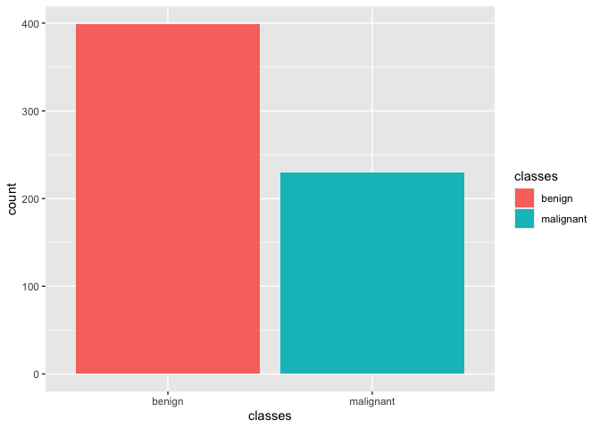
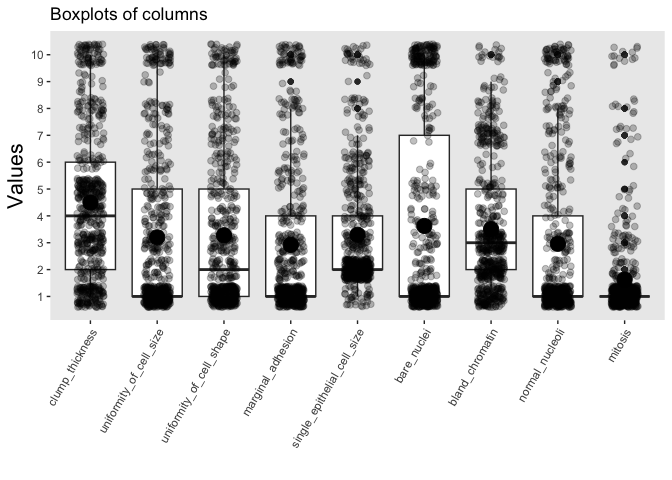
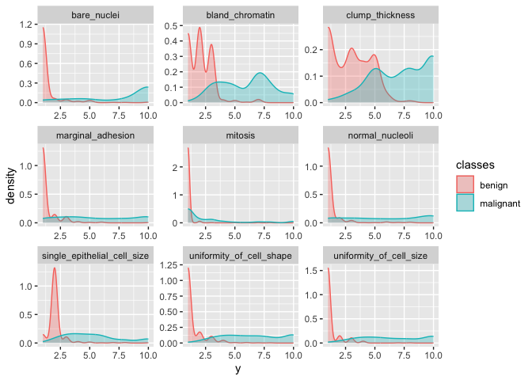
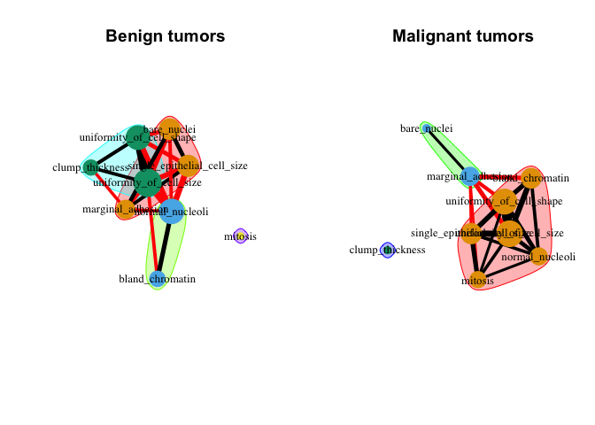
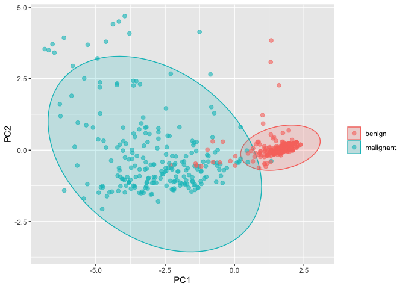
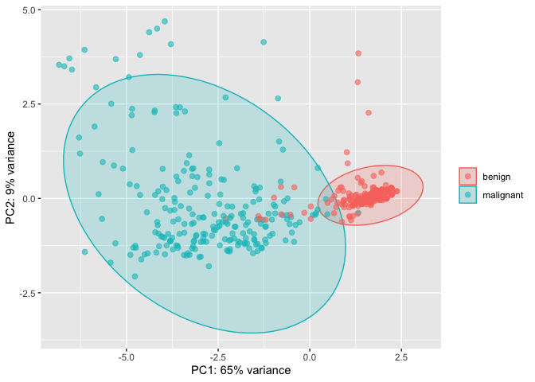

R Notebook
================

## Breast Cancer Diagnosis

This example aims to assess whether a lump in a breast could be
malignant (cancerous) or benign (non-cancerous) from digitized images of
a fine-needle aspiration biopsy.The breast cancer database was obtained
from the University of Wisconsin Hospitals, Madison, from Dr William H.
Wolberg. You can download the data from the UCI Machine learning
database.

## The Dataset

**clump_thickness:** (1-10). Benign cells tend to be grouped in
monolayers, while cancerous cells are often grouped in multilayers.
Higher clumpthickness associated with cancer

**cell_size_uniformity:** (1-10). Cancer cells tend to vary in size and
shape. Loss of size uniformity associated with cancer

**cell_shape_uniformity:** (1-10). Uniformity of cell size/shape: Cancer
cells tend to vary in size and shape. Loss of size uniformity associated
with cancer

**marginal_adhesion:** (1-10). Normal cells tend to stick together.
Cancer cells tend to lose this ability. So the loss of adhesion is a
sign of malignancy.

**single_epithelial_cell_size:** (1-10). It is related to the uniformity
mentioned above. Epithelial cells that are significantly enlarged may be
a malignant cell.

**bare_nuclei:** (1-10). This is a term used for nuclei not surrounded
by cytoplasm (the rest of the cell). Those are typically seen in benign
tumors.

**bland_chromatin:** (1-10). Describes a uniform “texture” of the
nucleus seen in benign cells. In cancer cells, the chromatin tends to be
more coarse.

**normal_nucleoli:** (1-10). Nucleoli are small structures seen in the
nucleus. In normal cells, the nucleolus is usually very small if visible
at all. In cancer cells, the nucleoli become more prominent, and
sometimes there are more of them.

**mitoses:** (1-10). Cancer is essentially a disease of uncontrolled
mitosis. Higher number indicates cancer

**classes:** Benign (non-cancerous) or malignant (cancerous) lump in a
breast.

## Importing the data and wrangling

import libraries and read in data

``` r
library(tidyverse) # for tidy data analysis
```

    ## ── Attaching core tidyverse packages ──────────────────────── tidyverse 2.0.0 ──
    ## ✔ dplyr     1.1.4     ✔ readr     2.1.5
    ## ✔ forcats   1.0.0     ✔ stringr   1.5.1
    ## ✔ ggplot2   3.5.0     ✔ tibble    3.2.1
    ## ✔ lubridate 1.9.3     ✔ tidyr     1.3.1
    ## ✔ purrr     1.0.2     
    ## ── Conflicts ────────────────────────────────────────── tidyverse_conflicts() ──
    ## ✖ dplyr::filter() masks stats::filter()
    ## ✖ dplyr::lag()    masks stats::lag()
    ## ℹ Use the conflicted package (<http://conflicted.r-lib.org/>) to force all conflicts to become errors

``` r
library(readr)     # for fast reading of input files

bc_data0 <-  read.csv(paste0("http://archive.ics.uci.edu/ml/machine-learning-databases/","breast-cancer-wisconsin/breast-cancer-wisconsin.data"), 
                      header = FALSE, stringsAsFactors = F)

names (bc_data0) <-  c("sample_code_number", 
                      "clump_thickness", 
                      "uniformity_of_cell_size", 
                      "uniformity_of_cell_shape", 
                      "marginal_adhesion", 
                      "single_epithelial_cell_size", 
                      "bare_nuclei", 
                      "bland_chromatin", 
                      "normal_nucleoli", 
                      "mitosis", 
                      "classes")
```

Check format for all columns

``` r
str(bc_data0)
```

    ## 'data.frame':    699 obs. of  11 variables:
    ##  $ sample_code_number         : int  1000025 1002945 1015425 1016277 1017023 1017122 1018099 1018561 1033078 1033078 ...
    ##  $ clump_thickness            : int  5 5 3 6 4 8 1 2 2 4 ...
    ##  $ uniformity_of_cell_size    : int  1 4 1 8 1 10 1 1 1 2 ...
    ##  $ uniformity_of_cell_shape   : int  1 4 1 8 1 10 1 2 1 1 ...
    ##  $ marginal_adhesion          : int  1 5 1 1 3 8 1 1 1 1 ...
    ##  $ single_epithelial_cell_size: int  2 7 2 3 2 7 2 2 2 2 ...
    ##  $ bare_nuclei                : chr  "1" "10" "2" "4" ...
    ##  $ bland_chromatin            : int  3 3 3 3 3 9 3 3 1 2 ...
    ##  $ normal_nucleoli            : int  1 2 1 7 1 7 1 1 1 1 ...
    ##  $ mitosis                    : int  1 1 1 1 1 1 1 1 5 1 ...
    ##  $ classes                    : int  2 2 2 2 2 4 2 2 2 2 ...

Notice how bare_nuclei does not follow the correct formatting

``` r
bc_data0$bare_nuclei = as.integer(bc_data0$bare_nuclei)
```

    ## Warning: NAs introduced by coercion

NA introduced by coercion is just a warning message that lets us know
that some values got coerced into NA

``` r
bc_data1 <- bc_data0 %>%
  dplyr::mutate(classes = ifelse(classes == "2", "benign",
                          ifelse(classes == "4", "malignant", NA)))
```

Check again!

``` r
str(bc_data1)
```

    ## 'data.frame':    699 obs. of  11 variables:
    ##  $ sample_code_number         : int  1000025 1002945 1015425 1016277 1017023 1017122 1018099 1018561 1033078 1033078 ...
    ##  $ clump_thickness            : int  5 5 3 6 4 8 1 2 2 4 ...
    ##  $ uniformity_of_cell_size    : int  1 4 1 8 1 10 1 1 1 2 ...
    ##  $ uniformity_of_cell_shape   : int  1 4 1 8 1 10 1 2 1 1 ...
    ##  $ marginal_adhesion          : int  1 5 1 1 3 8 1 1 1 1 ...
    ##  $ single_epithelial_cell_size: int  2 7 2 3 2 7 2 2 2 2 ...
    ##  $ bare_nuclei                : int  1 10 2 4 1 10 10 1 1 1 ...
    ##  $ bland_chromatin            : int  3 3 3 3 3 9 3 3 1 2 ...
    ##  $ normal_nucleoli            : int  1 2 1 7 1 7 1 1 1 1 ...
    ##  $ mitosis                    : int  1 1 1 1 1 1 1 1 5 1 ...
    ##  $ classes                    : chr  "benign" "benign" "benign" "benign" ...

``` r
head(bc_data1)
```

    ##   sample_code_number clump_thickness uniformity_of_cell_size
    ## 1            1000025               5                       1
    ## 2            1002945               5                       4
    ## 3            1015425               3                       1
    ## 4            1016277               6                       8
    ## 5            1017023               4                       1
    ## 6            1017122               8                      10
    ##   uniformity_of_cell_shape marginal_adhesion single_epithelial_cell_size
    ## 1                        1                 1                           2
    ## 2                        4                 5                           7
    ## 3                        1                 1                           2
    ## 4                        8                 1                           3
    ## 5                        1                 3                           2
    ## 6                       10                 8                           7
    ##   bare_nuclei bland_chromatin normal_nucleoli mitosis   classes
    ## 1           1               3               1       1    benign
    ## 2          10               3               2       1    benign
    ## 3           2               3               1       1    benign
    ## 4           4               3               7       1    benign
    ## 5           1               3               1       1    benign
    ## 6          10               9               7       1 malignant

# Exploratory Data Analysis

**Start with a basic view**

``` r
summary(bc_data1) 
```

    ##  sample_code_number clump_thickness  uniformity_of_cell_size
    ##  Min.   :   61634   Min.   : 1.000   Min.   : 1.000         
    ##  1st Qu.:  870688   1st Qu.: 2.000   1st Qu.: 1.000         
    ##  Median : 1171710   Median : 4.000   Median : 1.000         
    ##  Mean   : 1071704   Mean   : 4.418   Mean   : 3.134         
    ##  3rd Qu.: 1238298   3rd Qu.: 6.000   3rd Qu.: 5.000         
    ##  Max.   :13454352   Max.   :10.000   Max.   :10.000         
    ##                                                             
    ##  uniformity_of_cell_shape marginal_adhesion single_epithelial_cell_size
    ##  Min.   : 1.000           Min.   : 1.000    Min.   : 1.000             
    ##  1st Qu.: 1.000           1st Qu.: 1.000    1st Qu.: 2.000             
    ##  Median : 1.000           Median : 1.000    Median : 2.000             
    ##  Mean   : 3.207           Mean   : 2.807    Mean   : 3.216             
    ##  3rd Qu.: 5.000           3rd Qu.: 4.000    3rd Qu.: 4.000             
    ##  Max.   :10.000           Max.   :10.000    Max.   :10.000             
    ##                                                                        
    ##   bare_nuclei     bland_chromatin  normal_nucleoli     mitosis      
    ##  Min.   : 1.000   Min.   : 1.000   Min.   : 1.000   Min.   : 1.000  
    ##  1st Qu.: 1.000   1st Qu.: 2.000   1st Qu.: 1.000   1st Qu.: 1.000  
    ##  Median : 1.000   Median : 3.000   Median : 1.000   Median : 1.000  
    ##  Mean   : 3.545   Mean   : 3.438   Mean   : 2.867   Mean   : 1.589  
    ##  3rd Qu.: 6.000   3rd Qu.: 5.000   3rd Qu.: 4.000   3rd Qu.: 1.000  
    ##  Max.   :10.000   Max.   :10.000   Max.   :10.000   Max.   :10.000  
    ##  NA's   :16                                                         
    ##    classes         
    ##  Length:699        
    ##  Class :character  
    ##  Mode  :character  
    ##                    
    ##                    
    ##                    
    ## 

Checks: Does each row repesent a unique patient record?

``` r
length(bc_data1$sample_code_number)
```

    ## [1] 699

``` r
length(unique(bc_data1$sample_code_number))
```

    ## [1] 645

No! We want to filter out unique patients

``` r
bc_data2 <- bc_data1 %>% distinct(sample_code_number,.keep_all = TRUE)
```

We also don’t really care about sample code number, as it is not a
biological variable. Therefore, can remove.

``` r
row.names(bc_data2) <- bc_data2$sample_code_number
bc_data3 <- bc_data2 %>% select(-sample_code_number)
```

**Automated EDA**

``` r
library(DataExplorer)
create_report(bc_data3)
```

    ## 
    ## 
    ## processing file: report.rmd

    ##   |                                             |                                     |   0%  |                                             |.                                    |   2%                                   |                                             |..                                   |   5% [global_options]                  |                                             |...                                  |   7%                                   |                                             |....                                 |  10% [introduce]                       |                                             |....                                 |  12%                                   |                                             |.....                                |  14% [plot_intro]                      |                                             |......                               |  17%                                   |                                             |.......                              |  19% [data_structure]                  |                                             |........                             |  21%                                   |                                             |.........                            |  24% [missing_profile]                 |                                             |..........                           |  26%                                   |                                             |...........                          |  29% [univariate_distribution_header]  |                                             |...........                          |  31%                                   |                                             |............                         |  33% [plot_histogram]                  |                                             |.............                        |  36%                                   |                                             |..............                       |  38% [plot_density]                    |                                             |...............                      |  40%                                   |                                             |................                     |  43% [plot_frequency_bar]              |                                             |.................                    |  45%                                   |                                             |..................                   |  48% [plot_response_bar]               |                                             |..................                   |  50%                                   |                                             |...................                  |  52% [plot_with_bar]                   |                                             |....................                 |  55%                                   |                                             |.....................                |  57% [plot_normal_qq]                  |                                             |......................               |  60%                                   |                                             |.......................              |  62% [plot_response_qq]                |                                             |........................             |  64%                                   |                                             |.........................            |  67% [plot_by_qq]                      |                                             |..........................           |  69%                                   |                                             |..........................           |  71% [correlation_analysis]            |                                             |...........................          |  74%                                   |                                             |............................         |  76% [principal_component_analysis]    |                                             |.............................        |  79%                                   |                                             |..............................       |  81% [bivariate_distribution_header]   |                                             |...............................      |  83%                                   |                                             |................................     |  86% [plot_response_boxplot]           |                                             |.................................    |  88%                                   |                                             |.................................    |  90% [plot_by_boxplot]                 |                                             |..................................   |  93%                                   |                                             |...................................  |  95% [plot_response_scatterplot]       |                                             |.................................... |  98%                                   |                                             |.....................................| 100% [plot_by_scatterplot]           

    ## output file: /Users/dollina/Desktop/examples/EDA/report.knit.md

    ## /Applications/RStudio.app/Contents/Resources/app/quarto/bin/tools/pandoc +RTS -K512m -RTS /Users/dollina/Desktop/examples/EDA/report.knit.md --to html4 --from markdown+autolink_bare_uris+tex_math_single_backslash --output /Users/dollina/Desktop/examples/EDA/report.html --lua-filter /Library/Frameworks/R.framework/Versions/4.3-arm64/Resources/library/rmarkdown/rmarkdown/lua/pagebreak.lua --lua-filter /Library/Frameworks/R.framework/Versions/4.3-arm64/Resources/library/rmarkdown/rmarkdown/lua/latex-div.lua --embed-resources --standalone --variable bs3=TRUE --section-divs --table-of-contents --toc-depth 6 --template /Library/Frameworks/R.framework/Versions/4.3-arm64/Resources/library/rmarkdown/rmd/h/default.html --no-highlight --variable highlightjs=1 --variable theme=yeti --mathjax --variable 'mathjax-url=https://mathjax.rstudio.com/latest/MathJax.js?config=TeX-AMS-MML_HTMLorMML' --include-in-header /var/folders/2k/032n9_716rq3cvqs4rc046g00000gn/T//RtmpjpVvXq/rmarkdown-str190d1919094f.html

    ## 
    ## Output created: report.html

# Missing Data

We will use only complete cases. Missing values can be imputed and we
will see this later. For now, we will remove!

``` r
bc_data4 <- bc_data3[complete.cases(bc_data3),]
```

**Save this data version for future use**. Saving data objects as RDS
files reduce computation time making analysis efficient.

``` r
saveRDS(bc_data4, file="bc_clean.RDS")
```

Separate predictors from target features.

``` r
bc_pred <- bc_data4 %>% select(-classes)
bc_class <- bc_data4$classes
```

# Exploratory Data Analysis contd

``` r
ggplot(bc_data4, aes(x = classes, fill = classes)) + geom_bar()
```

<!-- -->

Notice that we have more benign than malignant – there is a class
imbalance. We will deal with unbalanced datasets later

``` r
g <- ggplot(stack(bc_pred), aes(x = ind, y = values)) + geom_boxplot() + 
  labs(title = "Boxplots of columns") + labs(x = "", y = "Values") + 
  scale_y_continuous(breaks = seq(1, 10, by = 1))+
  theme(axis.text.x = element_text(angle = 60, hjust = 1, vjust=1),
    legend.position = "none",
    axis.title = element_text(size = 16),
    panel.grid = element_blank()
  )

g +
  geom_jitter(size = 2, alpha = 0.25, width = 0.2) +
  stat_summary(fun = mean, geom = "point", size = 5)
```

<!-- -->

``` r
gather(bc_data4, x, y, clump_thickness:mitosis) %>%  # selecting data pairs
  ggplot(aes(x = y, color = classes, fill = classes)) +
  geom_density(alpha = 0.3) +
  facet_wrap( ~ x, scales = "free", ncol = 3)
```

<!-- -->

# Correlation matrices

**Benign**

``` r
co_mat_benign <- filter(bc_data4, classes == "benign") %>%
  select(-classes) %>%
  cor()
```

**Malignant**

``` r
co_mat_malignant <- filter(bc_data4, classes == "malignant") %>%
  select(-classes) %>%
  cor()
```

Generate graph plots (<http://kateto.net/networks-r-igraph>)

``` r
library(igraph)
```

    ## 
    ## Attaching package: 'igraph'

    ## The following objects are masked from 'package:lubridate':
    ## 
    ##     %--%, union

    ## The following objects are masked from 'package:dplyr':
    ## 
    ##     as_data_frame, groups, union

    ## The following objects are masked from 'package:purrr':
    ## 
    ##     compose, simplify

    ## The following object is masked from 'package:tidyr':
    ## 
    ##     crossing

    ## The following object is masked from 'package:tibble':
    ## 
    ##     as_data_frame

    ## The following objects are masked from 'package:stats':
    ## 
    ##     decompose, spectrum

    ## The following object is masked from 'package:base':
    ## 
    ##     union

``` r
g_benign <- graph.adjacency(co_mat_benign,
                            weighted = TRUE,
                            diag = FALSE,
                            mode = "upper")
```

    ## Warning: `graph.adjacency()` was deprecated in igraph 2.0.0.
    ## ℹ Please use `graph_from_adjacency_matrix()` instead.
    ## This warning is displayed once every 8 hours.
    ## Call `lifecycle::last_lifecycle_warnings()` to see where this warning was
    ## generated.

``` r
g_malignant <- graph.adjacency(co_mat_malignant,
                               weighted = TRUE,
                               diag = FALSE,
                               mode = "upper")

cut.off_b <- mean(E(g_benign)$weight)
cut.off_m <- mean(E(g_malignant)$weight)

g_benign_2 <- delete_edges(g_benign, E(g_benign)[weight < cut.off_b])
g_malignant_2 <- delete_edges(g_malignant, E(g_malignant)[weight < cut.off_m])

c_g_benign_2 <- cluster_fast_greedy(g_benign_2) # implements network clustering methods 
c_g_malignant_2 <- cluster_fast_greedy(g_malignant_2) 
```

``` r
par(mfrow = c(1,2))

plot(c_g_benign_2, g_benign_2,
     vertex.size = colSums(co_mat_benign) * 10, # the larger the vertex/node the more correlated that vertex is with other features
     vertex.frame.color = NA, 
     vertex.label.color = "black", 
     vertex.label.cex = 0.8,
     edge.width = E(g_benign_2)$weight * 15,
     layout = layout_with_fr(g_benign_2),
     main = "Benign tumors")

plot(c_g_malignant_2, g_malignant_2,
     vertex.size = colSums(co_mat_malignant) * 10,
     vertex.frame.color = NA, 
     vertex.label.color = "black", 
     vertex.label.cex = 0.8,
     edge.width = E(g_malignant_2)$weight * 15,
     layout = layout_with_fr(g_malignant_2),
     main = "Malignant tumors")
```

<!-- -->

The nodes in the graph represent each feature, and edge between the two
nodes indicates that the features are correlated

# Principal Component Analysis

``` r
library(ellipse)
```

    ## 
    ## Attaching package: 'ellipse'

    ## The following object is masked from 'package:graphics':
    ## 
    ##     pairs

``` r
# perform pca and extract scores
pcaOutput <- prcomp(as.matrix(select(bc_data4, -classes)), scale = TRUE, center = TRUE)
pcaOutput2 <- as.data.frame(pcaOutput$x)
PoV <- pcaOutput$sdev^2/sum(pcaOutput$sdev^2)
PoV
```

    ## [1] 0.653184302 0.088031547 0.060154632 0.052205084 0.041379221 0.033779177
    ## [7] 0.032639833 0.028634161 0.009992044

Define groups for plotting

``` r
pcaOutput2$groups <- bc_data4$classes
centroids <- aggregate(cbind(PC1, PC2) ~ groups, pcaOutput2, mean)

conf.rgn  <- do.call(rbind, lapply(unique(pcaOutput2$groups), function(t)
  data.frame(groups = as.character(t),
             ellipse(cov(pcaOutput2[pcaOutput2$groups == t, 1:2]),
                     centre = as.matrix(centroids[centroids$groups == t, 2:3]),
                     level = 0.95),
             stringsAsFactors = FALSE)))

g1 <- ggplot(data = pcaOutput2, aes(x = PC1, y = PC2, group = groups, color = groups)) + 
  geom_polygon(data = conf.rgn, aes(fill = groups), alpha = 0.2) +
  geom_point(size = 2, alpha = 0.6) + 
  labs(color = "",
       fill = "") 

g1
```

<!-- -->

Can also make output more informative

``` r
g2 <- g1+
  labs(x = paste0("PC1: ", round(PoV[1], digits = 2) * 100, "% variance"),
       y = paste0("PC2: ", round(PoV[2], digits = 2) * 100, "% variance"))

g2
```

<!-- -->

There is a package to help with ggplot grammar

``` r
#install.packages("esquisse")
#esquisse::esquisser()
```

**Basic summary stats**

``` r
psych::describeBy(bc_data4)
```

    ## Warning in psych::describeBy(bc_data4): no grouping variable requested

    ##                             vars   n mean   sd median trimmed  mad min max
    ## clump_thickness                1 629 4.50 2.86      4    4.25 2.97   1  10
    ## uniformity_of_cell_size        2 629 3.20 3.07      1    2.64 0.00   1  10
    ## uniformity_of_cell_shape       3 629 3.28 3.00      2    2.75 1.48   1  10
    ## marginal_adhesion              4 629 2.92 2.93      1    2.31 0.00   1  10
    ## single_epithelial_cell_size    5 629 3.30 2.26      2    2.85 0.00   1  10
    ## bare_nuclei                    6 629 3.62 3.67      1    3.16 0.00   1  10
    ## bland_chromatin                7 629 3.51 2.47      3    3.18 1.48   1  10
    ## normal_nucleoli                8 629 2.96 3.12      1    2.34 0.00   1  10
    ## mitosis                        9 629 1.63 1.76      1    1.14 0.00   1  10
    ## classes*                      10 629 1.37 0.48      1    1.33 0.00   1   2
    ##                             range skew kurtosis   se
    ## clump_thickness                 9 0.56    -0.72 0.11
    ## uniformity_of_cell_size         9 1.18    -0.04 0.12
    ## uniformity_of_cell_shape        9 1.11    -0.14 0.12
    ## marginal_adhesion               9 1.42     0.64 0.12
    ## single_epithelial_cell_size     9 1.63     1.83 0.09
    ## bare_nuclei                     9 0.94    -0.89 0.15
    ## bland_chromatin                 9 1.03    -0.02 0.10
    ## normal_nucleoli                 9 1.33     0.20 0.12
    ## mitosis                         9 3.39    11.29 0.07
    ## classes*                        1 0.56    -1.69 0.02

``` r
psych::describeBy(bc_pred, bc_class)
```

    ## 
    ##  Descriptive statistics by group 
    ## group: benign
    ##                             vars   n mean   sd median trimmed  mad min max
    ## clump_thickness                1 399 2.93 1.66      3    2.84 2.97   1   8
    ## uniformity_of_cell_size        2 399 1.29 0.79      1    1.08 0.00   1   8
    ## uniformity_of_cell_shape       3 399 1.41 0.94      1    1.18 0.00   1   8
    ## marginal_adhesion              4 399 1.34 0.91      1    1.11 0.00   1  10
    ## single_epithelial_cell_size    5 399 2.12 0.89      2    2.01 0.00   1  10
    ## bare_nuclei                    6 399 1.34 1.11      1    1.04 0.00   1  10
    ## bland_chromatin                7 399 2.09 1.07      2    1.98 1.48   1   7
    ## normal_nucleoli                8 399 1.26 0.98      1    1.02 0.00   1   8
    ## mitosis                        9 399 1.07 0.53      1    1.00 0.00   1   8
    ##                             range  skew kurtosis   se
    ## clump_thickness                 7  0.34    -0.83 0.08
    ## uniformity_of_cell_size         7  3.91    21.13 0.04
    ## uniformity_of_cell_shape        7  3.08    12.00 0.05
    ## marginal_adhesion               9  4.19    25.62 0.05
    ## single_epithelial_cell_size     9  4.52    28.47 0.04
    ## bare_nuclei                     9  4.48    24.30 0.06
    ## bland_chromatin                 6  1.65     5.15 0.05
    ## normal_nucleoli                 7  4.91    25.95 0.05
    ## mitosis                         7 10.46   119.29 0.03
    ## ------------------------------------------------------------ 
    ## group: malignant
    ##                             vars   n mean   sd median trimmed  mad min max
    ## clump_thickness                1 230 7.23 2.44      8    7.43 2.97   1  10
    ## uniformity_of_cell_size        2 230 6.52 2.72      6    6.61 2.97   1  10
    ## uniformity_of_cell_shape       3 230 6.52 2.57      6    6.58 2.97   1  10
    ## marginal_adhesion              4 230 5.66 3.20      5    5.70 4.45   1  10
    ## single_epithelial_cell_size    5 230 5.34 2.45      5    5.17 2.97   1  10
    ## bare_nuclei                    6 230 7.59 3.15     10    8.07 0.00   1  10
    ## bland_chromatin                7 230 5.97 2.27      7    5.92 2.97   1  10
    ## normal_nucleoli                8 230 5.90 3.36      6    6.01 4.45   1  10
    ## mitosis                        9 230 2.60 2.56      1    2.01 0.00   1  10
    ##                             range  skew kurtosis   se
    ## clump_thickness                 9 -0.44    -0.86 0.16
    ## uniformity_of_cell_size         9 -0.06    -1.28 0.18
    ## uniformity_of_cell_shape        9 -0.02    -1.21 0.17
    ## marginal_adhesion               9  0.06    -1.40 0.21
    ## single_epithelial_cell_size     9  0.58    -0.65 0.16
    ## bare_nuclei                     9 -0.89    -0.76 0.21
    ## bland_chromatin                 9 -0.02    -0.98 0.15
    ## normal_nucleoli                 9 -0.14    -1.47 0.22
    ## mitosis                         9  1.75     2.01 0.17

**A better looking table**

``` r
arsenal::tableby(classes~., data = bc_data4, total= TRUE) %>% summary(text = TRUE)
```

    ## 
    ## 
    ## |                            | benign (N=399) | malignant (N=230) | Total (N=629)  | p value|
    ## |:---------------------------|:--------------:|:-----------------:|:--------------:|-------:|
    ## |clump_thickness             |                |                   |                | < 0.001|
    ## |-  Mean (SD)                | 2.927 (1.657)  |   7.226 (2.439)   | 4.499 (2.864)  |        |
    ## |-  Range                    | 1.000 - 8.000  |  1.000 - 10.000   | 1.000 - 10.000 |        |
    ## |uniformity_of_cell_size     |                |                   |                | < 0.001|
    ## |-  Mean (SD)                | 1.288 (0.789)  |   6.522 (2.716)   | 3.202 (3.074)  |        |
    ## |-  Range                    | 1.000 - 8.000  |  1.000 - 10.000   | 1.000 - 10.000 |        |
    ## |uniformity_of_cell_shape    |                |                   |                | < 0.001|
    ## |-  Mean (SD)                | 1.414 (0.944)  |   6.517 (2.569)   | 3.280 (3.004)  |        |
    ## |-  Range                    | 1.000 - 8.000  |  1.000 - 10.000   | 1.000 - 10.000 |        |
    ## |marginal_adhesion           |                |                   |                | < 0.001|
    ## |-  Mean (SD)                | 1.343 (0.911)  |   5.657 (3.198)   | 2.921 (2.929)  |        |
    ## |-  Range                    | 1.000 - 10.000 |  1.000 - 10.000   | 1.000 - 10.000 |        |
    ## |single_epithelial_cell_size |                |                   |                | < 0.001|
    ## |-  Mean (SD)                | 2.120 (0.894)  |   5.339 (2.446)   | 3.297 (2.257)  |        |
    ## |-  Range                    | 1.000 - 10.000 |  1.000 - 10.000   | 1.000 - 10.000 |        |
    ## |bare_nuclei                 |                |                   |                | < 0.001|
    ## |-  Mean (SD)                | 1.338 (1.109)  |   7.591 (3.147)   | 3.625 (3.671)  |        |
    ## |-  Range                    | 1.000 - 10.000 |  1.000 - 10.000   | 1.000 - 10.000 |        |
    ## |bland_chromatin             |                |                   |                | < 0.001|
    ## |-  Mean (SD)                | 2.088 (1.075)  |   5.970 (2.269)   | 3.507 (2.472)  |        |
    ## |-  Range                    | 1.000 - 7.000  |  1.000 - 10.000   | 1.000 - 10.000 |        |
    ## |normal_nucleoli             |                |                   |                | < 0.001|
    ## |-  Mean (SD)                | 1.263 (0.981)  |   5.904 (3.364)   | 2.960 (3.121)  |        |
    ## |-  Range                    | 1.000 - 8.000  |  1.000 - 10.000   | 1.000 - 10.000 |        |
    ## |mitosis                     |                |                   |                | < 0.001|
    ## |-  Mean (SD)                | 1.068 (0.529)  |   2.604 (2.557)   | 1.630 (1.763)  |        |
    ## |-  Range                    | 1.000 - 8.000  |  1.000 - 10.000   | 1.000 - 10.000 |        |
