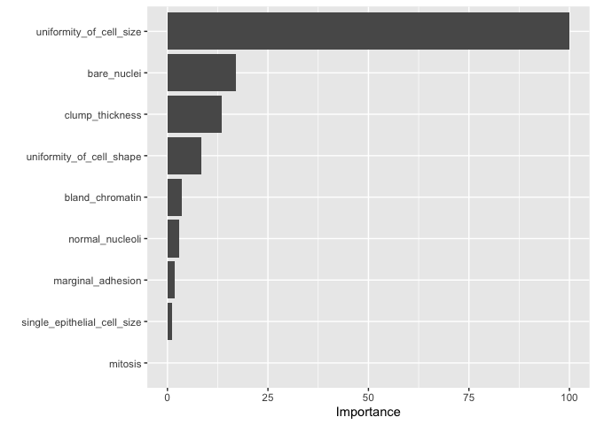
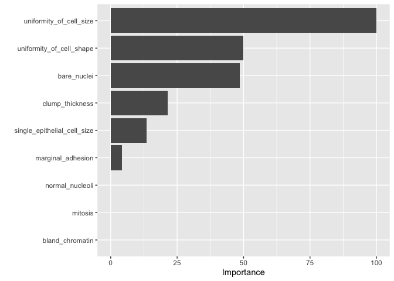
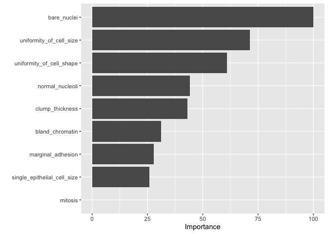

Boosting
================

# Libraries, evaluation function, and clean data

``` r
library(tidyverse)
```

    ## ── Attaching core tidyverse packages ──────────────────────── tidyverse 2.0.0 ──
    ## ✔ dplyr     1.1.4     ✔ readr     2.1.5
    ## ✔ forcats   1.0.0     ✔ stringr   1.5.1
    ## ✔ ggplot2   3.5.0     ✔ tibble    3.2.1
    ## ✔ lubridate 1.9.3     ✔ tidyr     1.3.1
    ## ✔ purrr     1.0.2     
    ## ── Conflicts ────────────────────────────────────────── tidyverse_conflicts() ──
    ## ✖ dplyr::filter() masks stats::filter()
    ## ✖ dplyr::lag()    masks stats::lag()
    ## ℹ Use the conflicted package (<http://conflicted.r-lib.org/>) to force all conflicts to become errors

``` r
library(caret)
```

    ## Loading required package: lattice
    ## 
    ## Attaching package: 'caret'
    ## 
    ## The following object is masked from 'package:purrr':
    ## 
    ##     lift

``` r
library(pROC)
```

    ## Type 'citation("pROC")' for a citation.
    ## 
    ## Attaching package: 'pROC'
    ## 
    ## The following objects are masked from 'package:stats':
    ## 
    ##     cov, smooth, var

``` r
# Build custom AUC function to extract AUC
# from the caret model object
eval_mod <- function(model, data) {
  pred <- predict(model, data)
  cm <- caret::confusionMatrix(pred, data$classes, positive="malignant")
  auc <- roc(data$classes,
             predict(model, data, type = "prob")[, "malignant"]) %>% auc()
  result <- c(cm$overall["Accuracy"],cm$byClass['Sensitivity'], cm$byClass['Specificity'], cm$byClass['F1'],AUC=auc)
  return(result)
}

bc_data <- readRDS("../EDA/bc_clean.RDS")
bc_data$classes <- as.factor(bc_data$classes)
```

``` r
set.seed(2024)
index <- caret::createDataPartition(bc_data$classes, p = 0.7, list = FALSE)

train_data <- bc_data[index, ]
test_data  <- bc_data[-index, ]

train_data$classes %>% table(.)
```

    ## .
    ##    benign malignant 
    ##       280       161

``` r
set.seed(2024)
ctrl <- trainControl(method = "repeatedcv", 
                      number = 5, 
                      repeats = 3,  
                      savePredictions = TRUE,
                      summaryFunction = twoClassSummary,
                      classProbs = TRUE)
```

``` r
set.seed(2024)
forest_fit <- train(
  classes ~ .,
  data = train_data,                         
  method = "ranger",
  metric = "ROC",
  trControl = trainControl(method = "cv", number = 5, classProbs = TRUE, summaryFunction = twoClassSummary),
  importance="impurity"
)
forest <- eval_mod(forest_fit,test_data)
```

    ## Setting levels: control = benign, case = malignant

    ## Setting direction: controls < cases

``` r
set.seed(2024)
gbm_fit <- train(classes ~ .,
                  data = train_data,
                  method = "gbm",
                  verbose = FALSE,
                  metric = "ROC",
                  trControl = ctrl)

gbm <- eval_mod(gbm_fit,test_data)
```

    ## Setting levels: control = benign, case = malignant

    ## Setting direction: controls < cases

``` r
modelLookup("xgbTree")
```

    ##     model        parameter                          label forReg forClass
    ## 1 xgbTree          nrounds          # Boosting Iterations   TRUE     TRUE
    ## 2 xgbTree        max_depth                 Max Tree Depth   TRUE     TRUE
    ## 3 xgbTree              eta                      Shrinkage   TRUE     TRUE
    ## 4 xgbTree            gamma         Minimum Loss Reduction   TRUE     TRUE
    ## 5 xgbTree colsample_bytree     Subsample Ratio of Columns   TRUE     TRUE
    ## 6 xgbTree min_child_weight Minimum Sum of Instance Weight   TRUE     TRUE
    ## 7 xgbTree        subsample           Subsample Percentage   TRUE     TRUE
    ##   probModel
    ## 1      TRUE
    ## 2      TRUE
    ## 3      TRUE
    ## 4      TRUE
    ## 5      TRUE
    ## 6      TRUE
    ## 7      TRUE

``` r
# nrounds: number of boosting iterations, M
# max_depth: maximum tree depth
# eta: shrinkage,  η
# gamma: minimum loss reduction
# colsamle_bytree: subsample ratio of columns
# min_child_weight: minimum size of instance weight
# substample: subsample percentage
# An alternative to tuneGrid
# tuneLength argument is used to control the number of combinations generated by this random tuning parameter search.
# 
# 
```

``` r
set.seed(2024)

xgbGrid <-  expand.grid(nrounds = c(10, 10, 10), 
                        max_depth = c(1, 5, 1), 
                        gamma = c(0, 1, 0.1), eta = 0.3,
                          colsample_bytree=1, 
                          min_child_weight=1, subsample = 0.5)

xgboostT_fit <- train(classes ~ .,
                 data = train_data,
                 method = "xgbTree",
                 verbose = FALSE, tuneGrid = xgbGrid,
                 trControl = ctrl)
```

    ## Warning in train.default(x, y, weights = w, ...): The metric "Accuracy" was not
    ## in the result set. ROC will be used instead.

``` r
xgboost_tree <- eval_mod(xgboostT_fit,test_data)
```

    ## Setting levels: control = benign, case = malignant

    ## Setting direction: controls < cases

``` r
set.seed(2024)

xgboostL_fit <- train(classes ~ .,
                      data = train_data,
                      method = "xgbLinear",
                      verbose = FALSE,
                      tuneLength=5,
                      trControl = ctrl)
```

    ## Warning in train.default(x, y, weights = w, ...): The metric "Accuracy" was not
    ## in the result set. ROC will be used instead.

``` r
xgboost_linear <- eval_mod(xgboostL_fit,test_data)
```

    ## Setting levels: control = benign, case = malignant

    ## Setting direction: controls < cases

``` r
rbind(forest, gbm, xgboost_tree, xgboost_linear)
```

    ##                 Accuracy Sensitivity Specificity        F1       AUC
    ## forest         0.9521277   0.9275362   0.9663866 0.9343066 0.9930581
    ## gbm            0.9414894   0.8985507   0.9663866 0.9185185 0.9886737
    ## xgboost_tree   0.9468085   0.9275362   0.9579832 0.9275362 0.9895871
    ## xgboost_linear 0.9308511   0.8695652   0.9663866 0.9022556 0.9896480

# Variable importance

Calculate variable importance using vip

``` r
varImp(xgboostL_fit)
```

    ## xgbLinear variable importance
    ## 
    ##                             Overall
    ## uniformity_of_cell_size     100.000
    ## bare_nuclei                  17.099
    ## clump_thickness              13.490
    ## uniformity_of_cell_shape      8.498
    ## bland_chromatin               3.531
    ## normal_nucleoli               2.922
    ## marginal_adhesion             1.853
    ## single_epithelial_cell_size   1.071
    ## mitosis                       0.000

``` r
vip::vip(xgboostL_fit , num_features = 10) 
```

<!-- -->

``` r
vip::vip(xgboostT_fit , num_features = 10) 
```

<!-- -->

``` r
vip::vip(forest_fit , num_features = 10) 
```

<!-- -->
