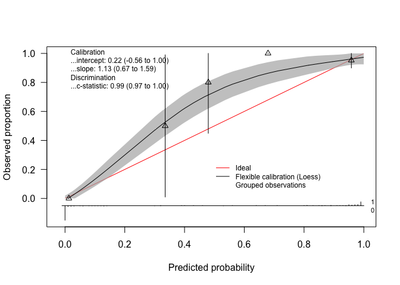

Calibration
================

Import libraries

``` r
library(tidyverse)
```

    ## ── Attaching core tidyverse packages ──────────────────────── tidyverse 2.0.0 ──
    ## ✔ dplyr     1.1.4     ✔ readr     2.1.5
    ## ✔ forcats   1.0.0     ✔ stringr   1.5.1
    ## ✔ ggplot2   3.5.1     ✔ tibble    3.2.1
    ## ✔ lubridate 1.9.4     ✔ tidyr     1.3.1
    ## ✔ purrr     1.0.4     
    ## ── Conflicts ────────────────────────────────────────── tidyverse_conflicts() ──
    ## ✖ dplyr::filter() masks stats::filter()
    ## ✖ dplyr::lag()    masks stats::lag()
    ## ℹ Use the conflicted package (<http://conflicted.r-lib.org/>) to force all conflicts to become errors

``` r
library(caret)
```

    ## Loading required package: lattice
    ## 
    ## Attaching package: 'caret'
    ## 
    ## The following object is masked from 'package:purrr':
    ## 
    ##     lift

``` r
library(pROC)
```

    ## Type 'citation("pROC")' for a citation.
    ## 
    ## Attaching package: 'pROC'
    ## 
    ## The following objects are masked from 'package:stats':
    ## 
    ##     cov, smooth, var

``` r
# Build custom AUC function to extract AUC
# from the caret model object
eval_mod <- function(model, data) {
  pred <- predict(model, data)
  cm <- caret::confusionMatrix(pred, data$classes, positive="malignant")
  auc <- roc(data$classes,
             predict(model, data, type = "prob")[, "malignant"]) %>% auc()
  result <- c(cm$overall["Accuracy"],cm$byClass['Sensitivity'], cm$byClass['Specificity'], cm$byClass['F1'],AUC=auc)
  return(result)
}
```

Read in clean data

``` r
bc_data <- readRDS("../EDA/bc_clean.RDS")
bc_data$classes <- as.factor(bc_data$classes)

set.seed(2024)
index <- caret::createDataPartition(bc_data$classes, p = 0.7, list = FALSE)

train_data <- bc_data[index, ]
test_data  <- bc_data[-index, ]

train_data$classes %>% table(.)
```

    ## .
    ##    benign malignant 
    ##       280       161

``` r
set.seed(2024)
```

``` r
ctrl <- trainControl(method = "repeatedcv", 
                     number = 5, 
                     repeats = 3,  
                     savePredictions = TRUE,
                     summaryFunction = twoClassSummary,
                     classProbs = TRUE)
set.seed(2024)

forest_fit <- train(
  classes ~ .,
  data = train_data,                         
  method = "ranger",
  metric = "ROC",
  trControl = trainControl(method = "cv", number = 5, classProbs = TRUE, summaryFunction = twoClassSummary),
  importance="impurity"
)
forest <- eval_mod(forest_fit,test_data)
```

    ## Setting levels: control = benign, case = malignant

    ## Setting direction: controls < cases

``` r
pred_test <- data.frame(pred= predict(forest_fit, test_data, type = "prob"), obs = ifelse(test_data$classes=="malignant",1,0)) 

calperf <- CalibrationCurves::val.prob.ci.2(pred_test$pred.malignant, pred_test$obs, logistic.cal = TRUE,  col.log = "orange")
```

    ## Warning in CalibrationCurves::val.prob.ci.2(pred_test$pred.malignant,
    ## pred_test$obs, : 25 observations deleted from logistic calibration due to
    ## probs. of 0 or 1

<!-- -->

``` r
calperf <- CalibrationCurves::val.prob.ci.2(pred_test$pred.malignant, pred_test$obs,allowPerfectPredictions=TRUE, cuts = seq(0,1,by=.2))
```

    ## Warning in CalibrationCurves::val.prob.ci.2(pred_test$pred.malignant, pred_test$obs, : There are predictions with value 0 or 1! These are replaced by values 1e-8 and 1 - 1e-8, respectively. Take this into account when interpreting the performance measures, as these are not calculated with the original values.
    ## 
    ## Please check your model, as this may be an indication of overfitting. Predictions of 0 or 1 imply that these predicted values are deterministic.
    ## 
    ## We observe this in the following cases:
    ##  - logistic regression: with quasi-complete separation, the coefficients tend to infinity;
    ##  - tree-based methods: one of the leaf nodes contains only observations with either 0 or 1;
    ##  - neural networks: the weights tend to infinity and this is known as weight/gradient explosion.

<!-- -->

``` r
calperf
```

    ## Call:
    ## CalibrationCurves::val.prob.ci.2(p = pred_test$pred.malignant, 
    ##     y = pred_test$obs, cuts = seq(0, 1, by = 0.2), allowPerfectPredictions = TRUE)
    ## 
    ## A 95% confidence interval is given for the calibration intercept, calibration slope and c-statistic. 
    ## 
    ##           Dxy       C (ROC)            R2             D      D:Chi-sq 
    ##   0.986116186   0.993058093   0.919539275   1.111232572 209.911723549 
    ##           D:p             U      U:Chi-sq           U:p             Q 
    ##   0.000000000  -0.007154544   0.654945703   0.720742858   1.118387116 
    ##         Brier     Intercept         Slope          Emax  Brier scaled 
    ##   0.029756629   0.221749065   1.129260493   0.064332110   0.871913495 
    ##          Eavg           ECI 
    ##   0.030489176   0.333158475

    ## Warning in print.CalibrationCurve(x): There are predictions with value 0 or 1! These are replaced by values 1e-8 and 1 - 1e-8, respectively. Take this into account when interpreting the performance measures, as these are not calculated with the original values.
    ## 
    ## Please check your model, as this may be an indication of overfitting. Predictions of 0 or 1 imply that these predicted values are deterministic.
    ## 
    ## We observe this in the following cases:
    ##  - logistic regression: with quasi-complete separation, the coefficients tend to infinity;
    ##  - tree-based methods: one of the leaf nodes contains only observations with either 0 or 1;
    ##  - neural networks: the weights tend to infinity and this is known as weight/gradient explosion.

\#Decision Curve analysis

``` r
?dcurves::dca
dca_object <- dcurves::dca(obs ~ pred.malignant, data = pred_test)
```

    ## Assuming '1' is [Event] and '0' is [non-Event]

``` r
dca_object%>%
  plot(smooth = TRUE)
```

<!-- -->

``` r
dcurves::dca(obs ~ pred.malignant, data = pred_test,
    as_probability = "pred.malignant",
    thresholds = seq(0.05, 0.35, 0.15)
) %>%
  as_tibble() %>%
  select(label, threshold, net_benefit) %>%
  gt::gt() %>%
  gt::fmt_percent(columns = threshold, decimals = 0) %>%
  gt::fmt(columns = net_benefit, fns = function(x) round(x, digits = 3)) %>%
  gt::cols_label(
    label = "Strategy",
    threshold = "Decision Threshold",
    net_benefit = "Net Benefit"
  ) %>%
  gt::cols_align("left", columns = label)
```

    ## Assuming '1' is [Event] and '0' is [non-Event]

<div id="ynlvayvfia" style="padding-left:0px;padding-right:0px;padding-top:10px;padding-bottom:10px;overflow-x:auto;overflow-y:auto;width:auto;height:auto;">
<style>#ynlvayvfia table {
  font-family: system-ui, 'Segoe UI', Roboto, Helvetica, Arial, sans-serif, 'Apple Color Emoji', 'Segoe UI Emoji', 'Segoe UI Symbol', 'Noto Color Emoji';
  -webkit-font-smoothing: antialiased;
  -moz-osx-font-smoothing: grayscale;
}
&#10;#ynlvayvfia thead, #ynlvayvfia tbody, #ynlvayvfia tfoot, #ynlvayvfia tr, #ynlvayvfia td, #ynlvayvfia th {
  border-style: none;
}
&#10;#ynlvayvfia p {
  margin: 0;
  padding: 0;
}
&#10;#ynlvayvfia .gt_table {
  display: table;
  border-collapse: collapse;
  line-height: normal;
  margin-left: auto;
  margin-right: auto;
  color: #333333;
  font-size: 16px;
  font-weight: normal;
  font-style: normal;
  background-color: #FFFFFF;
  width: auto;
  border-top-style: solid;
  border-top-width: 2px;
  border-top-color: #A8A8A8;
  border-right-style: none;
  border-right-width: 2px;
  border-right-color: #D3D3D3;
  border-bottom-style: solid;
  border-bottom-width: 2px;
  border-bottom-color: #A8A8A8;
  border-left-style: none;
  border-left-width: 2px;
  border-left-color: #D3D3D3;
}
&#10;#ynlvayvfia .gt_caption {
  padding-top: 4px;
  padding-bottom: 4px;
}
&#10;#ynlvayvfia .gt_title {
  color: #333333;
  font-size: 125%;
  font-weight: initial;
  padding-top: 4px;
  padding-bottom: 4px;
  padding-left: 5px;
  padding-right: 5px;
  border-bottom-color: #FFFFFF;
  border-bottom-width: 0;
}
&#10;#ynlvayvfia .gt_subtitle {
  color: #333333;
  font-size: 85%;
  font-weight: initial;
  padding-top: 3px;
  padding-bottom: 5px;
  padding-left: 5px;
  padding-right: 5px;
  border-top-color: #FFFFFF;
  border-top-width: 0;
}
&#10;#ynlvayvfia .gt_heading {
  background-color: #FFFFFF;
  text-align: center;
  border-bottom-color: #FFFFFF;
  border-left-style: none;
  border-left-width: 1px;
  border-left-color: #D3D3D3;
  border-right-style: none;
  border-right-width: 1px;
  border-right-color: #D3D3D3;
}
&#10;#ynlvayvfia .gt_bottom_border {
  border-bottom-style: solid;
  border-bottom-width: 2px;
  border-bottom-color: #D3D3D3;
}
&#10;#ynlvayvfia .gt_col_headings {
  border-top-style: solid;
  border-top-width: 2px;
  border-top-color: #D3D3D3;
  border-bottom-style: solid;
  border-bottom-width: 2px;
  border-bottom-color: #D3D3D3;
  border-left-style: none;
  border-left-width: 1px;
  border-left-color: #D3D3D3;
  border-right-style: none;
  border-right-width: 1px;
  border-right-color: #D3D3D3;
}
&#10;#ynlvayvfia .gt_col_heading {
  color: #333333;
  background-color: #FFFFFF;
  font-size: 100%;
  font-weight: normal;
  text-transform: inherit;
  border-left-style: none;
  border-left-width: 1px;
  border-left-color: #D3D3D3;
  border-right-style: none;
  border-right-width: 1px;
  border-right-color: #D3D3D3;
  vertical-align: bottom;
  padding-top: 5px;
  padding-bottom: 6px;
  padding-left: 5px;
  padding-right: 5px;
  overflow-x: hidden;
}
&#10;#ynlvayvfia .gt_column_spanner_outer {
  color: #333333;
  background-color: #FFFFFF;
  font-size: 100%;
  font-weight: normal;
  text-transform: inherit;
  padding-top: 0;
  padding-bottom: 0;
  padding-left: 4px;
  padding-right: 4px;
}
&#10;#ynlvayvfia .gt_column_spanner_outer:first-child {
  padding-left: 0;
}
&#10;#ynlvayvfia .gt_column_spanner_outer:last-child {
  padding-right: 0;
}
&#10;#ynlvayvfia .gt_column_spanner {
  border-bottom-style: solid;
  border-bottom-width: 2px;
  border-bottom-color: #D3D3D3;
  vertical-align: bottom;
  padding-top: 5px;
  padding-bottom: 5px;
  overflow-x: hidden;
  display: inline-block;
  width: 100%;
}
&#10;#ynlvayvfia .gt_spanner_row {
  border-bottom-style: hidden;
}
&#10;#ynlvayvfia .gt_group_heading {
  padding-top: 8px;
  padding-bottom: 8px;
  padding-left: 5px;
  padding-right: 5px;
  color: #333333;
  background-color: #FFFFFF;
  font-size: 100%;
  font-weight: initial;
  text-transform: inherit;
  border-top-style: solid;
  border-top-width: 2px;
  border-top-color: #D3D3D3;
  border-bottom-style: solid;
  border-bottom-width: 2px;
  border-bottom-color: #D3D3D3;
  border-left-style: none;
  border-left-width: 1px;
  border-left-color: #D3D3D3;
  border-right-style: none;
  border-right-width: 1px;
  border-right-color: #D3D3D3;
  vertical-align: middle;
  text-align: left;
}
&#10;#ynlvayvfia .gt_empty_group_heading {
  padding: 0.5px;
  color: #333333;
  background-color: #FFFFFF;
  font-size: 100%;
  font-weight: initial;
  border-top-style: solid;
  border-top-width: 2px;
  border-top-color: #D3D3D3;
  border-bottom-style: solid;
  border-bottom-width: 2px;
  border-bottom-color: #D3D3D3;
  vertical-align: middle;
}
&#10;#ynlvayvfia .gt_from_md > :first-child {
  margin-top: 0;
}
&#10;#ynlvayvfia .gt_from_md > :last-child {
  margin-bottom: 0;
}
&#10;#ynlvayvfia .gt_row {
  padding-top: 8px;
  padding-bottom: 8px;
  padding-left: 5px;
  padding-right: 5px;
  margin: 10px;
  border-top-style: solid;
  border-top-width: 1px;
  border-top-color: #D3D3D3;
  border-left-style: none;
  border-left-width: 1px;
  border-left-color: #D3D3D3;
  border-right-style: none;
  border-right-width: 1px;
  border-right-color: #D3D3D3;
  vertical-align: middle;
  overflow-x: hidden;
}
&#10;#ynlvayvfia .gt_stub {
  color: #333333;
  background-color: #FFFFFF;
  font-size: 100%;
  font-weight: initial;
  text-transform: inherit;
  border-right-style: solid;
  border-right-width: 2px;
  border-right-color: #D3D3D3;
  padding-left: 5px;
  padding-right: 5px;
}
&#10;#ynlvayvfia .gt_stub_row_group {
  color: #333333;
  background-color: #FFFFFF;
  font-size: 100%;
  font-weight: initial;
  text-transform: inherit;
  border-right-style: solid;
  border-right-width: 2px;
  border-right-color: #D3D3D3;
  padding-left: 5px;
  padding-right: 5px;
  vertical-align: top;
}
&#10;#ynlvayvfia .gt_row_group_first td {
  border-top-width: 2px;
}
&#10;#ynlvayvfia .gt_row_group_first th {
  border-top-width: 2px;
}
&#10;#ynlvayvfia .gt_summary_row {
  color: #333333;
  background-color: #FFFFFF;
  text-transform: inherit;
  padding-top: 8px;
  padding-bottom: 8px;
  padding-left: 5px;
  padding-right: 5px;
}
&#10;#ynlvayvfia .gt_first_summary_row {
  border-top-style: solid;
  border-top-color: #D3D3D3;
}
&#10;#ynlvayvfia .gt_first_summary_row.thick {
  border-top-width: 2px;
}
&#10;#ynlvayvfia .gt_last_summary_row {
  padding-top: 8px;
  padding-bottom: 8px;
  padding-left: 5px;
  padding-right: 5px;
  border-bottom-style: solid;
  border-bottom-width: 2px;
  border-bottom-color: #D3D3D3;
}
&#10;#ynlvayvfia .gt_grand_summary_row {
  color: #333333;
  background-color: #FFFFFF;
  text-transform: inherit;
  padding-top: 8px;
  padding-bottom: 8px;
  padding-left: 5px;
  padding-right: 5px;
}
&#10;#ynlvayvfia .gt_first_grand_summary_row {
  padding-top: 8px;
  padding-bottom: 8px;
  padding-left: 5px;
  padding-right: 5px;
  border-top-style: double;
  border-top-width: 6px;
  border-top-color: #D3D3D3;
}
&#10;#ynlvayvfia .gt_last_grand_summary_row_top {
  padding-top: 8px;
  padding-bottom: 8px;
  padding-left: 5px;
  padding-right: 5px;
  border-bottom-style: double;
  border-bottom-width: 6px;
  border-bottom-color: #D3D3D3;
}
&#10;#ynlvayvfia .gt_striped {
  background-color: rgba(128, 128, 128, 0.05);
}
&#10;#ynlvayvfia .gt_table_body {
  border-top-style: solid;
  border-top-width: 2px;
  border-top-color: #D3D3D3;
  border-bottom-style: solid;
  border-bottom-width: 2px;
  border-bottom-color: #D3D3D3;
}
&#10;#ynlvayvfia .gt_footnotes {
  color: #333333;
  background-color: #FFFFFF;
  border-bottom-style: none;
  border-bottom-width: 2px;
  border-bottom-color: #D3D3D3;
  border-left-style: none;
  border-left-width: 2px;
  border-left-color: #D3D3D3;
  border-right-style: none;
  border-right-width: 2px;
  border-right-color: #D3D3D3;
}
&#10;#ynlvayvfia .gt_footnote {
  margin: 0px;
  font-size: 90%;
  padding-top: 4px;
  padding-bottom: 4px;
  padding-left: 5px;
  padding-right: 5px;
}
&#10;#ynlvayvfia .gt_sourcenotes {
  color: #333333;
  background-color: #FFFFFF;
  border-bottom-style: none;
  border-bottom-width: 2px;
  border-bottom-color: #D3D3D3;
  border-left-style: none;
  border-left-width: 2px;
  border-left-color: #D3D3D3;
  border-right-style: none;
  border-right-width: 2px;
  border-right-color: #D3D3D3;
}
&#10;#ynlvayvfia .gt_sourcenote {
  font-size: 90%;
  padding-top: 4px;
  padding-bottom: 4px;
  padding-left: 5px;
  padding-right: 5px;
}
&#10;#ynlvayvfia .gt_left {
  text-align: left;
}
&#10;#ynlvayvfia .gt_center {
  text-align: center;
}
&#10;#ynlvayvfia .gt_right {
  text-align: right;
  font-variant-numeric: tabular-nums;
}
&#10;#ynlvayvfia .gt_font_normal {
  font-weight: normal;
}
&#10;#ynlvayvfia .gt_font_bold {
  font-weight: bold;
}
&#10;#ynlvayvfia .gt_font_italic {
  font-style: italic;
}
&#10;#ynlvayvfia .gt_super {
  font-size: 65%;
}
&#10;#ynlvayvfia .gt_footnote_marks {
  font-size: 75%;
  vertical-align: 0.4em;
  position: initial;
}
&#10;#ynlvayvfia .gt_asterisk {
  font-size: 100%;
  vertical-align: 0;
}
&#10;#ynlvayvfia .gt_indent_1 {
  text-indent: 5px;
}
&#10;#ynlvayvfia .gt_indent_2 {
  text-indent: 10px;
}
&#10;#ynlvayvfia .gt_indent_3 {
  text-indent: 15px;
}
&#10;#ynlvayvfia .gt_indent_4 {
  text-indent: 20px;
}
&#10;#ynlvayvfia .gt_indent_5 {
  text-indent: 25px;
}
&#10;#ynlvayvfia .katex-display {
  display: inline-flex !important;
  margin-bottom: 0.75em !important;
}
&#10;#ynlvayvfia div.Reactable > div.rt-table > div.rt-thead > div.rt-tr.rt-tr-group-header > div.rt-th-group:after {
  height: 0px !important;
}
</style>
<table class="gt_table" data-quarto-disable-processing="false" data-quarto-bootstrap="false">
  <thead>
    <tr class="gt_col_headings">
      <th class="gt_col_heading gt_columns_bottom_border gt_left" rowspan="1" colspan="1" scope="col" id="label">Strategy</th>
      <th class="gt_col_heading gt_columns_bottom_border gt_right" rowspan="1" colspan="1" scope="col" id="threshold">Decision Threshold</th>
      <th class="gt_col_heading gt_columns_bottom_border gt_right" rowspan="1" colspan="1" scope="col" id="net_benefit">Net Benefit</th>
    </tr>
  </thead>
  <tbody class="gt_table_body">
    <tr><td headers="label" class="gt_row gt_left">Treat All</td>
<td headers="threshold" class="gt_row gt_right">5%</td>
<td headers="net_benefit" class="gt_row gt_right">0.334</td></tr>
    <tr><td headers="label" class="gt_row gt_left">Treat All</td>
<td headers="threshold" class="gt_row gt_right">20%</td>
<td headers="net_benefit" class="gt_row gt_right">0.209</td></tr>
    <tr><td headers="label" class="gt_row gt_left">Treat All</td>
<td headers="threshold" class="gt_row gt_right">35%</td>
<td headers="net_benefit" class="gt_row gt_right">0.026</td></tr>
    <tr><td headers="label" class="gt_row gt_left">Treat None</td>
<td headers="threshold" class="gt_row gt_right">5%</td>
<td headers="net_benefit" class="gt_row gt_right">0</td></tr>
    <tr><td headers="label" class="gt_row gt_left">Treat None</td>
<td headers="threshold" class="gt_row gt_right">20%</td>
<td headers="net_benefit" class="gt_row gt_right">0</td></tr>
    <tr><td headers="label" class="gt_row gt_left">Treat None</td>
<td headers="threshold" class="gt_row gt_right">35%</td>
<td headers="net_benefit" class="gt_row gt_right">0</td></tr>
    <tr><td headers="label" class="gt_row gt_left">pred.malignant</td>
<td headers="threshold" class="gt_row gt_right">5%</td>
<td headers="net_benefit" class="gt_row gt_right">0.365</td></tr>
    <tr><td headers="label" class="gt_row gt_left">pred.malignant</td>
<td headers="threshold" class="gt_row gt_right">20%</td>
<td headers="net_benefit" class="gt_row gt_right">0.356</td></tr>
    <tr><td headers="label" class="gt_row gt_left">pred.malignant</td>
<td headers="threshold" class="gt_row gt_right">35%</td>
<td headers="net_benefit" class="gt_row gt_right">0.34</td></tr>
  </tbody>
  &#10;  
</table>
</div>

``` r
# More here https://mskcc-epi-bio.github.io/decisioncurveanalysis/dca-tutorial-r.html
# 
# 
```
