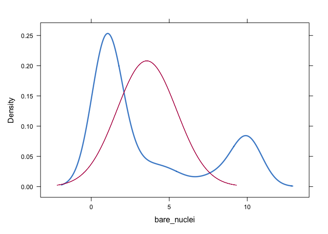
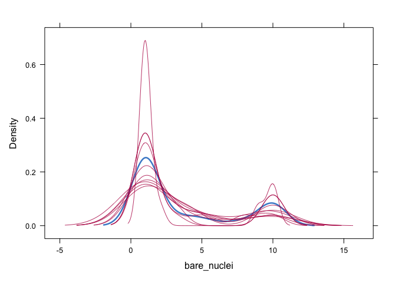

Logistic regression
================

# Importing libraries

``` r
library(tidyverse) # for tidy data analysis
```

    ## ── Attaching core tidyverse packages ──────────────────────── tidyverse 2.0.0 ──
    ## ✔ dplyr     1.1.4     ✔ readr     2.1.5
    ## ✔ forcats   1.0.0     ✔ stringr   1.5.1
    ## ✔ ggplot2   3.5.0     ✔ tibble    3.2.1
    ## ✔ lubridate 1.9.3     ✔ tidyr     1.3.1
    ## ✔ purrr     1.0.2     
    ## ── Conflicts ────────────────────────────────────────── tidyverse_conflicts() ──
    ## ✖ dplyr::filter() masks stats::filter()
    ## ✖ dplyr::lag()    masks stats::lag()
    ## ℹ Use the conflicted package (<http://conflicted.r-lib.org/>) to force all conflicts to become errors

``` r
library(readr)     # for fast reading of input files
library(caret)
```

    ## Loading required package: lattice
    ## 
    ## Attaching package: 'caret'
    ## 
    ## The following object is masked from 'package:purrr':
    ## 
    ##     lift

``` r
library(pROC)
```

    ## Type 'citation("pROC")' for a citation.
    ## 
    ## Attaching package: 'pROC'
    ## 
    ## The following objects are masked from 'package:stats':
    ## 
    ##     cov, smooth, var

# Function for extracting metrics

``` r
eval_mod <- function(model, data) {
  pred <- predict(model, data)
  cm <- caret::confusionMatrix(pred, data$classes, positive="malignant")
  auc <- roc(data$classes,
             predict(model, data, type = "prob")[, "malignant"]) %>% auc()
  result <- c(cm$overall["Accuracy"],cm$byClass['Sensitivity'], cm$byClass['Specificity'], cm$byClass['F1'],AUC=auc)
  return(result)
}
```

# Importing data

``` r
bc_data0 <-  read.csv(paste0("http://archive.ics.uci.edu/ml/machine-learning-databases/","breast-cancer-wisconsin/breast-cancer-wisconsin.data"), header = FALSE, stringsAsFactors = F)

names (bc_data0) <-  c("sample_code_number", 
                       "clump_thickness", 
                       "uniformity_of_cell_size", 
                       "uniformity_of_cell_shape", 
                       "marginal_adhesion", 
                       "single_epithelial_cell_size", 
                       "bare_nuclei", 
                       "bland_chromatin", 
                       "normal_nucleoli", 
                       "mitosis", 
                       "classes")
```

# Data wrangling

``` r
str(bc_data0)
```

    ## 'data.frame':    699 obs. of  11 variables:
    ##  $ sample_code_number         : int  1000025 1002945 1015425 1016277 1017023 1017122 1018099 1018561 1033078 1033078 ...
    ##  $ clump_thickness            : int  5 5 3 6 4 8 1 2 2 4 ...
    ##  $ uniformity_of_cell_size    : int  1 4 1 8 1 10 1 1 1 2 ...
    ##  $ uniformity_of_cell_shape   : int  1 4 1 8 1 10 1 2 1 1 ...
    ##  $ marginal_adhesion          : int  1 5 1 1 3 8 1 1 1 1 ...
    ##  $ single_epithelial_cell_size: int  2 7 2 3 2 7 2 2 2 2 ...
    ##  $ bare_nuclei                : chr  "1" "10" "2" "4" ...
    ##  $ bland_chromatin            : int  3 3 3 3 3 9 3 3 1 2 ...
    ##  $ normal_nucleoli            : int  1 2 1 7 1 7 1 1 1 1 ...
    ##  $ mitosis                    : int  1 1 1 1 1 1 1 1 5 1 ...
    ##  $ classes                    : int  2 2 2 2 2 4 2 2 2 2 ...

``` r
bc_data0$bare_nuclei = as.integer(bc_data0$bare_nuclei)
```

    ## Warning: NAs introduced by coercion

``` r
bc_data1 <- bc_data0 %>%
  dplyr::mutate(classes = ifelse(classes == "2", "benign",
                                 ifelse(classes == "4", "malignant", NA)))
```

# De-duplicate observations

``` r
bc_data2 <- bc_data1 %>% distinct(sample_code_number,.keep_all = TRUE)
row.names(bc_data2) <- bc_data2$sample_code_number
bc_data3 <- bc_data2 %>% select(-sample_code_number)
```

# Split data into training and testing

``` r
set.seed(123)
train.index <- caret::createDataPartition(bc_data3$classes, p = .7, list=FALSE)

train <- bc_data3[ train.index,]
valid  <- bc_data3[-train.index,]
```

# Check the missing values in the data

``` r
summary(train)
```

    ##  clump_thickness  uniformity_of_cell_size uniformity_of_cell_shape
    ##  Min.   : 1.000   Min.   : 1.000          Min.   : 1.000          
    ##  1st Qu.: 2.000   1st Qu.: 1.000          1st Qu.: 1.000          
    ##  Median : 4.000   Median : 1.000          Median : 2.000          
    ##  Mean   : 4.481   Mean   : 3.212          Mean   : 3.256          
    ##  3rd Qu.: 6.000   3rd Qu.: 5.000          3rd Qu.: 5.000          
    ##  Max.   :10.000   Max.   :10.000          Max.   :10.000          
    ##                                                                   
    ##  marginal_adhesion single_epithelial_cell_size  bare_nuclei    
    ##  Min.   : 1.000    Min.   : 1.00               Min.   : 1.000  
    ##  1st Qu.: 1.000    1st Qu.: 2.00               1st Qu.: 1.000  
    ##  Median : 1.000    Median : 2.00               Median : 1.000  
    ##  Mean   : 2.978    Mean   : 3.23               Mean   : 3.559  
    ##  3rd Qu.: 4.000    3rd Qu.: 4.00               3rd Qu.: 6.000  
    ##  Max.   :10.000    Max.   :10.00               Max.   :10.000  
    ##                                                NA's   :13      
    ##  bland_chromatin  normal_nucleoli     mitosis         classes         
    ##  Min.   : 1.000   Min.   : 1.000   Min.   : 1.000   Length:453        
    ##  1st Qu.: 2.000   1st Qu.: 1.000   1st Qu.: 1.000   Class :character  
    ##  Median : 3.000   Median : 1.000   Median : 1.000   Mode  :character  
    ##  Mean   : 3.468   Mean   : 2.921   Mean   : 1.581                     
    ##  3rd Qu.: 5.000   3rd Qu.: 4.000   3rd Qu.: 1.000                     
    ##  Max.   :10.000   Max.   :10.000   Max.   :10.000                     
    ## 

``` r
sapply(train, function(x) sum(is.na(x)))
```

    ##             clump_thickness     uniformity_of_cell_size 
    ##                           0                           0 
    ##    uniformity_of_cell_shape           marginal_adhesion 
    ##                           0                           0 
    ## single_epithelial_cell_size                 bare_nuclei 
    ##                           0                          13 
    ##             bland_chromatin             normal_nucleoli 
    ##                           0                           0 
    ##                     mitosis                     classes 
    ##                           0                           0

``` r
dim (train)
```

    ## [1] 453  10

# Pairwise deletion: ignore missing values

``` r
mean(train$bare_nuclei)
```

    ## [1] NA

``` r
mean(train$bare_nuclei, na.rm=TRUE)
```

    ## [1] 3.559091

``` r
mean(train$clump_thickness, na.rm=TRUE)
```

    ## [1] 4.481236

``` r
cor(train$bare_nuclei,train$clump_thickness)
```

    ## [1] NA

``` r
cor(train$bare_nuclei,train$clump_thickness, use = "pairwise.complete.obs")
```

    ## [1] 0.6015587

# Listwise deletion: Remove the rows where missing values occur.

``` r
listwise <- train[complete.cases(train),]
sapply(listwise, function(x) sum(is.na(x)))
```

    ##             clump_thickness     uniformity_of_cell_size 
    ##                           0                           0 
    ##    uniformity_of_cell_shape           marginal_adhesion 
    ##                           0                           0 
    ## single_epithelial_cell_size                 bare_nuclei 
    ##                           0                           0 
    ##             bland_chromatin             normal_nucleoli 
    ##                           0                           0 
    ##                     mitosis                     classes 
    ##                           0                           0

``` r
dim(listwise)
```

    ## [1] 440  10

``` r
mean(listwise$bare_nuclei)
```

    ## [1] 3.559091

``` r
mean(listwise$clump_thickness)
```

    ## [1] 4.511364

``` r
cor(listwise$bare_nuclei,listwise$clump_thickness)
```

    ## [1] 0.6015587

# Impute missing value with mean

Multiple imputation by chained equations (MICE): blue is observed, red
is imputed

``` r
Mean_imp <- mice::mice(train, m=5, method = 'mean', print = FALSE)
```

    ## Warning: Number of logged events: 1

``` r
mice::densityplot(Mean_imp)
```

<!-- -->

``` r
# MULTIPLE IMPUTATION USING PREDICTIVE MEAN MATCHING
pmm_imp <- mice::mice(train,m=10, method = "pmm", print = FALSE)
```

    ## Warning: Number of logged events: 1

``` r
mice::densityplot(pmm_imp)
```

<!-- -->

``` r
imputed<-complete(data=pmm_imp)
mean(imputed$bare_nuclei)
```

    ## [1] 3.534216

``` r
mean(listwise$bare_nuclei)
```

    ## [1] 3.559091

``` r
mean(imputed$clump_thickness)
```

    ## [1] 4.481236

``` r
mean(listwise$clump_thickness)
```

    ## [1] 4.511364

``` r
mean(train$clump_thickness)
```

    ## [1] 4.481236

Will not impute validation

``` r
sapply(valid, function(x) sum(is.na(x)))
```

    ##             clump_thickness     uniformity_of_cell_size 
    ##                           0                           0 
    ##    uniformity_of_cell_shape           marginal_adhesion 
    ##                           0                           0 
    ## single_epithelial_cell_size                 bare_nuclei 
    ##                           0                           3 
    ##             bland_chromatin             normal_nucleoli 
    ##                           0                           0 
    ##                     mitosis                     classes 
    ##                           0                           0

``` r
completeValid <- valid[complete.cases(valid),]
table(completeValid$classes)
```

    ## 
    ##    benign malignant 
    ##       120        69

``` r
imputed$classes <- as.factor(imputed$classes)
completeValid$classes <- as.factor(completeValid$classes)
```

# Class Imbalance

``` r
table(imputed$classes)
```

    ## 
    ##    benign malignant 
    ##       290       163

``` r
set.seed(123)
ctrl = trainControl(method = "repeatedcv", 
                                number = 5, 
                                repeats = 3, 
                                summaryFunction = twoClassSummary,
                                classProbs = TRUE,
                                verboseIter = FALSE)

orig_fit <- caret::train(classes ~ .,
                  data = imputed,
                  method = "glm",
                  family = "binomial",
                  preProcess = c("scale", "center"),
                  metric ="ROC",
                  trControl = ctrl)
```

    ## Warning: glm.fit: fitted probabilities numerically 0 or 1 occurred

``` r
original <- eval_mod(orig_fit, completeValid)
```

    ## Setting levels: control = benign, case = malignant

    ## Setting direction: controls < cases

# Downsampling

``` r
set.seed(123)
ctrl$sampling <- "down"
down_fit <- train(classes ~ .,
                  data = imputed,
                  method = "glm",
                  family = "binomial",
                  preProcess = c("scale", "center"),
                  metric = "ROC",
                  trControl = ctrl)
```

    ## Warning: glm.fit: algorithm did not converge

    ## Warning: glm.fit: fitted probabilities numerically 0 or 1 occurred

    ## Warning: glm.fit: fitted probabilities numerically 0 or 1 occurred

    ## Warning: glm.fit: fitted probabilities numerically 0 or 1 occurred

    ## Warning: glm.fit: fitted probabilities numerically 0 or 1 occurred

    ## Warning: glm.fit: algorithm did not converge

    ## Warning: glm.fit: fitted probabilities numerically 0 or 1 occurred

``` r
down <- eval_mod(down_fit, completeValid)
```

    ## Setting levels: control = benign, case = malignant

    ## Setting direction: controls < cases

# Upsampling

``` r
set.seed(123)
ctrl$sampling <- "up"
up_fit <- train(classes ~ .,
                  data = imputed,
                  method = "glm",
                  family = "binomial",
                  preProcess = c("scale", "center"),
                  metric = "ROC",
                  trControl = ctrl)
```

    ## Warning: glm.fit: fitted probabilities numerically 0 or 1 occurred

    ## Warning: glm.fit: fitted probabilities numerically 0 or 1 occurred

``` r
up <- eval_mod(up_fit, completeValid)
```

    ## Setting levels: control = benign, case = malignant

    ## Setting direction: controls < cases

# SMOTE

``` r
set.seed(123)

ctrl$sampling <- "smote"

smote_fit <- train(classes ~ .,
                   data = imputed,
                   method = "glm",
                   family = "binomial",
                   preProcess = c("scale", "center"),
                   metric = "ROC",
                   trControl = ctrl)
```

    ## Loading required package: recipes

    ## 
    ## Attaching package: 'recipes'

    ## The following object is masked from 'package:stringr':
    ## 
    ##     fixed

    ## The following object is masked from 'package:stats':
    ## 
    ##     step

    ## Warning: glm.fit: fitted probabilities numerically 0 or 1 occurred

    ## Warning: glm.fit: fitted probabilities numerically 0 or 1 occurred

``` r
smote <- eval_mod(smote_fit, completeValid)
```

    ## Setting levels: control = benign, case = malignant

    ## Setting direction: controls < cases

``` r
Final <- rbind(original, down, up, smote)
Final
```

    ##          Accuracy Sensitivity Specificity        F1       AUC
    ## original 0.962963   0.9420290   0.9750000 0.9489051 0.9966184
    ## down     0.962963   0.9565217   0.9666667 0.9496403 0.9954106
    ## up       0.968254   0.9565217   0.9750000 0.9565217 0.9963768
    ## smote    0.968254   0.9565217   0.9750000 0.9565217 0.9964976
