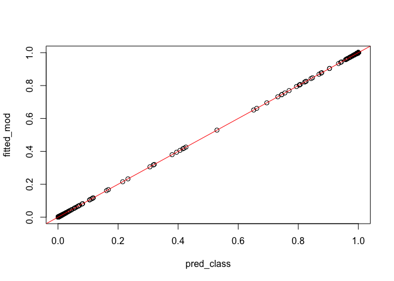
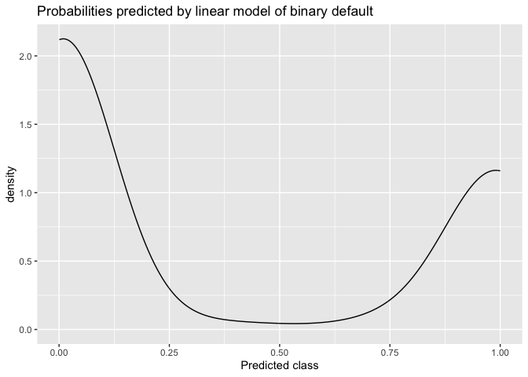
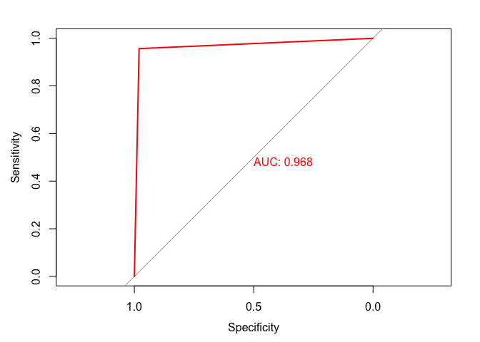
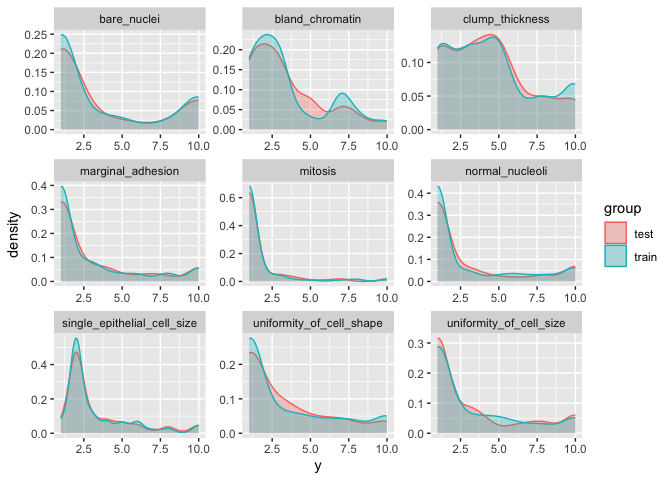
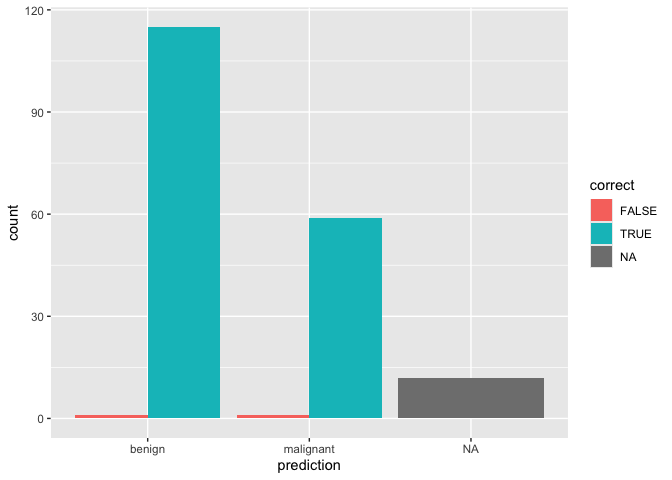

R Notebook
================

# Read clean data

``` r
library(tidyverse)
```

    ## ── Attaching core tidyverse packages ──────────────────────── tidyverse 2.0.0 ──
    ## ✔ dplyr     1.1.4     ✔ readr     2.1.5
    ## ✔ forcats   1.0.0     ✔ stringr   1.5.1
    ## ✔ ggplot2   3.5.0     ✔ tibble    3.2.1
    ## ✔ lubridate 1.9.3     ✔ tidyr     1.3.1
    ## ✔ purrr     1.0.2     
    ## ── Conflicts ────────────────────────────────────────── tidyverse_conflicts() ──
    ## ✖ dplyr::filter() masks stats::filter()
    ## ✖ dplyr::lag()    masks stats::lag()
    ## ℹ Use the conflicted package (<http://conflicted.r-lib.org/>) to force all conflicts to become errors

``` r
bc_data <- readRDS("../EDA/bc_clean.RDS")
str(bc_data)
```

    ## 'data.frame':    629 obs. of  10 variables:
    ##  $ clump_thickness            : int  5 5 3 6 4 8 1 2 2 1 ...
    ##  $ uniformity_of_cell_size    : int  1 4 1 8 1 10 1 1 1 1 ...
    ##  $ uniformity_of_cell_shape   : int  1 4 1 8 1 10 1 2 1 1 ...
    ##  $ marginal_adhesion          : int  1 5 1 1 3 8 1 1 1 1 ...
    ##  $ single_epithelial_cell_size: int  2 7 2 3 2 7 2 2 2 1 ...
    ##  $ bare_nuclei                : int  1 10 2 4 1 10 10 1 1 1 ...
    ##  $ bland_chromatin            : int  3 3 3 3 3 9 3 3 1 3 ...
    ##  $ normal_nucleoli            : int  1 2 1 7 1 7 1 1 1 1 ...
    ##  $ mitosis                    : int  1 1 1 1 1 1 1 1 5 1 ...
    ##  $ classes                    : chr  "benign" "benign" "benign" "benign" ...

``` r
#model_logit <-  glm(classes~., data= bc_data, family = "binomial")
```

Notice that you get an error requiring the Y values to be between zero
and one

``` r
?glm
```

We reset classes from character type to factor

``` r
str(bc_data)
```

    ## 'data.frame':    629 obs. of  10 variables:
    ##  $ clump_thickness            : int  5 5 3 6 4 8 1 2 2 1 ...
    ##  $ uniformity_of_cell_size    : int  1 4 1 8 1 10 1 1 1 1 ...
    ##  $ uniformity_of_cell_shape   : int  1 4 1 8 1 10 1 2 1 1 ...
    ##  $ marginal_adhesion          : int  1 5 1 1 3 8 1 1 1 1 ...
    ##  $ single_epithelial_cell_size: int  2 7 2 3 2 7 2 2 2 1 ...
    ##  $ bare_nuclei                : int  1 10 2 4 1 10 10 1 1 1 ...
    ##  $ bland_chromatin            : int  3 3 3 3 3 9 3 3 1 3 ...
    ##  $ normal_nucleoli            : int  1 2 1 7 1 7 1 1 1 1 ...
    ##  $ mitosis                    : int  1 1 1 1 1 1 1 1 5 1 ...
    ##  $ classes                    : chr  "benign" "benign" "benign" "benign" ...

``` r
bc_data$classes <- as.factor(bc_data$classes)
```

Refit the model

``` r
model_logit <-  glm(classes~., data= bc_data, family = binomial)
summary(model_logit)
```

    ## 
    ## Call:
    ## glm(formula = classes ~ ., family = binomial, data = bc_data)
    ## 
    ## Coefficients:
    ##                              Estimate Std. Error z value Pr(>|z|)    
    ## (Intercept)                 -10.64326    1.35777  -7.839 4.55e-15 ***
    ## clump_thickness               0.60455    0.16528   3.658 0.000254 ***
    ## uniformity_of_cell_size       0.14420    0.25824   0.558 0.576578    
    ## uniformity_of_cell_shape      0.20959    0.28165   0.744 0.456782    
    ## marginal_adhesion             0.38782    0.13903   2.790 0.005279 ** 
    ## single_epithelial_cell_size   0.05694    0.17308   0.329 0.742194    
    ## bare_nuclei                   0.47284    0.11323   4.176 2.97e-05 ***
    ## bland_chromatin               0.38159    0.19134   1.994 0.046122 *  
    ## normal_nucleoli               0.20744    0.12313   1.685 0.092038 .  
    ## mitosis                       0.68789    0.32072   2.145 0.031967 *  
    ## ---
    ## Signif. codes:  0 '***' 0.001 '**' 0.01 '*' 0.05 '.' 0.1 ' ' 1
    ## 
    ## (Dispersion parameter for binomial family taken to be 1)
    ## 
    ##     Null deviance: 826.009  on 628  degrees of freedom
    ## Residual deviance:  84.699  on 619  degrees of freedom
    ## AIC: 104.7
    ## 
    ## Number of Fisher Scoring iterations: 8

``` r
confint(model_logit)
```

    ## Waiting for profiling to be done...

    ##                                    2.5 %     97.5 %
    ## (Intercept)                 -13.75141908 -8.3404956
    ## clump_thickness               0.30759573  0.9658142
    ## uniformity_of_cell_size      -0.31987969  0.6909445
    ## uniformity_of_cell_shape     -0.36042340  0.7416489
    ## marginal_adhesion             0.12629998  0.6837980
    ## single_epithelial_cell_size  -0.29593342  0.3941696
    ## bare_nuclei                   0.26550460  0.7151679
    ## bland_chromatin               0.01522577  0.7723125
    ## normal_nucleoli              -0.02762558  0.4606144
    ## mitosis                       0.04409590  1.2410291

Notice that these are on the log odds scale.

# Publication ready results

``` r
fit.apparent <- Publish::publish(model_logit, digits=1)$regressionTable
```

    ##                     Variable Units OddsRatio     CI.95 p-value 
    ##              clump_thickness             1.8 [1.3;2.5]    <0.1 
    ##      uniformity_of_cell_size             1.2 [0.7;1.9]     0.6 
    ##     uniformity_of_cell_shape             1.2 [0.7;2.1]     0.5 
    ##            marginal_adhesion             1.5 [1.1;1.9]    <0.1 
    ##  single_epithelial_cell_size             1.1 [0.8;1.5]     0.7 
    ##                  bare_nuclei             1.6 [1.3;2.0]    <0.1 
    ##              bland_chromatin             1.5 [1.0;2.1]    <0.1 
    ##              normal_nucleoli             1.2 [1.0;1.6]    <0.1 
    ##                      mitosis             2.0 [1.1;3.7]    <0.1

# Assessing the model’s accuracy

# Apparent accuracy—-

``` r
pred_class <- predict(model_logit, bc_data, type = "response")

fitted_mod <- fitted(model_logit)
plot(pred_class, fitted_mod)
abline(0,1, col="red")
```

<!-- -->

Fitted values are the same as predicted values using the training data

``` r
ggplot(data.frame(y_linear = pred_class), aes(pred_class)) +
  geom_density() +
  ggtitle("Probabilities predicted by linear model of binary default")+
  xlab("Predicted class")
```

<!-- -->

``` r
pred_class <- ifelse(pred_class>0.5,1,0) %>% factor(labels = c("benign","malignant"))
table(pred_class)
```

    ## pred_class
    ##    benign malignant 
    ##       401       228

# ROC Plots

``` r
library(caret)
```

    ## Loading required package: lattice

    ## 
    ## Attaching package: 'caret'

    ## The following object is masked from 'package:purrr':
    ## 
    ##     lift

``` r
library(pROC)
```

    ## Type 'citation("pROC")' for a citation.

    ## 
    ## Attaching package: 'pROC'

    ## The following objects are masked from 'package:stats':
    ## 
    ##     cov, smooth, var

``` r
library(plotROC)
```

    ## 
    ## Attaching package: 'plotROC'

    ## The following object is masked from 'package:pROC':
    ## 
    ##     ggroc

``` r
caret:: confusionMatrix(pred_class, bc_data$classes, positive ="malignant")
```

    ## Confusion Matrix and Statistics
    ## 
    ##            Reference
    ## Prediction  benign malignant
    ##   benign       391        10
    ##   malignant      8       220
    ##                                          
    ##                Accuracy : 0.9714         
    ##                  95% CI : (0.9551, 0.983)
    ##     No Information Rate : 0.6343         
    ##     P-Value [Acc > NIR] : <2e-16         
    ##                                          
    ##                   Kappa : 0.9382         
    ##                                          
    ##  Mcnemar's Test P-Value : 0.8137         
    ##                                          
    ##             Sensitivity : 0.9565         
    ##             Specificity : 0.9799         
    ##          Pos Pred Value : 0.9649         
    ##          Neg Pred Value : 0.9751         
    ##              Prevalence : 0.3657         
    ##          Detection Rate : 0.3498         
    ##    Detection Prevalence : 0.3625         
    ##       Balanced Accuracy : 0.9682         
    ##                                          
    ##        'Positive' Class : malignant      
    ## 

``` r
?caret::confusionMatrix
```

``` r
roc_mfit <- roc(bc_data$classes, as.numeric(pred_class))
```

    ## Setting levels: control = benign, case = malignant

    ## Setting direction: controls < cases

``` r
?roc
```

The first argument is the observed response, the second argument is the
predicted response. Be careful this is not a norm and you have to check
for every function.

``` r
plot(roc_mfit, col = "red", print.auc = T)
```

<!-- --> \#
Resampling

``` r
set.seed(2025)
index <- caret::createDataPartition(bc_data$classes, p = 0.7, list = FALSE)
```

By default, createDataPartition does a stratified random split of the
data.

``` r
train_data <- bc_data[index, ]
test_data  <- bc_data[-index, ]

bind_rows(data.frame(group = "train", train_data),
          data.frame(group = "test", test_data)) %>%
  gather(x, y, clump_thickness:mitosis) %>%
  ggplot(aes(x = y, color = group, fill = group)) +
  geom_density(alpha = 0.3) +
  facet_wrap( ~ x, scales = "free", ncol = 3)
```

<!-- --> Can see
that the training set and the test said are pretty similar in terms of
covariates

``` r
set.seed(2025)

logit_cv <- caret::train(classes ~ .,
                         data = train_data,
                         method = "glm",
                         family = "binomial",
                         preProcess = c("scale", "center"),
                         ## Center and scale the predictors for the training
                         ## set and all future samples.
                         trControl = trainControl(method = 'none')
)

summary(logit_cv)
```

    ## 
    ## Call:
    ## NULL
    ## 
    ## Coefficients:
    ##                             Estimate Std. Error z value Pr(>|z|)    
    ## (Intercept)                  -0.6435     0.3941  -1.633 0.102509    
    ## clump_thickness               2.2330     0.6720   3.323 0.000891 ***
    ## uniformity_of_cell_size       0.4755     1.0077   0.472 0.637023    
    ## uniformity_of_cell_shape      0.0797     1.1159   0.071 0.943059    
    ## marginal_adhesion             1.0764     0.4592   2.344 0.019069 *  
    ## single_epithelial_cell_size  -0.7198     0.5429  -1.326 0.184886    
    ## bare_nuclei                   2.2385     0.5519   4.056 4.99e-05 ***
    ## bland_chromatin               1.4019     0.5733   2.445 0.014479 *  
    ## normal_nucleoli               1.3018     0.5606   2.322 0.020219 *  
    ## mitosis                       1.7467     0.7263   2.405 0.016174 *  
    ## ---
    ## Signif. codes:  0 '***' 0.001 '**' 0.01 '*' 0.05 '.' 0.1 ' ' 1
    ## 
    ## (Dispersion parameter for binomial family taken to be 1)
    ## 
    ##     Null deviance: 578.843  on 440  degrees of freedom
    ## Residual deviance:  55.436  on 431  degrees of freedom
    ## AIC: 75.436
    ## 
    ## Number of Fisher Scoring iterations: 9

``` r
trControl_params = trainControl(method = "repeatedcv", 
                         number = 5, 
                         repeats = 3, 
                         savePredictions = TRUE, 
                         summaryFunction = twoClassSummary,
                         verboseIter = FALSE)

?trainControl
```

Method specifies how resampling will be done. Examples include cv, boot,
LOOCV, repeatedcv, and oob.

Number specifies the number of times resampling should be done for
methods that require resample, such as, cv and boot.

Repeats specifies the number of times to repeat resampling for methods
such as repeatedcv

``` r
logit_cv <- caret::train(classes ~ .,
                         data = train_data,
                         method = "glm",
                         family = "binomial",
                         preProcess = c("scale", "center"),
                         ## Center and scale the predictors for the training
                         ## set and all future samples.
                         trControl = trainControl(method = "repeatedcv", 
                                                  number = 5, 
                                                  repeats = 3, 
                                                  savePredictions = TRUE)
)
```

    ## Warning: glm.fit: fitted probabilities numerically 0 or 1 occurred

``` r
logit_cv
```

    ## Generalized Linear Model 
    ## 
    ## 441 samples
    ##   9 predictor
    ##   2 classes: 'benign', 'malignant' 
    ## 
    ## Pre-processing: scaled (9), centered (9) 
    ## Resampling: Cross-Validated (5 fold, repeated 3 times) 
    ## Summary of sample sizes: 353, 353, 353, 352, 353, 353, ... 
    ## Resampling results:
    ## 
    ##   Accuracy   Kappa    
    ##   0.9561457  0.9050285

We used 441 samples that had binary class benign malignant used tenfold
cross validation repeated 10 times. It also provides the cross-validated
results accuracy, and Kappa.

``` r
names(logit_cv)
```

    ##  [1] "method"       "modelInfo"    "modelType"    "results"      "pred"        
    ##  [6] "bestTune"     "call"         "dots"         "metric"       "control"     
    ## [11] "finalModel"   "preProcess"   "trainingData" "ptype"        "resample"    
    ## [16] "resampledCM"  "perfNames"    "maximize"     "yLimits"      "times"       
    ## [21] "levels"       "terms"        "coefnames"    "xlevels"

There are many parameters that are stored in the training object.

``` r
logit_cv$results
```

    ##   parameter  Accuracy     Kappa AccuracySD   KappaSD
    ## 1      none 0.9561457 0.9050285 0.01764432 0.0383776

``` r
logit_cv$finalModel
```

    ## 
    ## Call:  NULL
    ## 
    ## Coefficients:
    ##                 (Intercept)              clump_thickness  
    ##                     -0.6435                       2.2330  
    ##     uniformity_of_cell_size     uniformity_of_cell_shape  
    ##                      0.4755                       0.0797  
    ##           marginal_adhesion  single_epithelial_cell_size  
    ##                      1.0764                      -0.7198  
    ##                 bare_nuclei              bland_chromatin  
    ##                      2.2385                       1.4019  
    ##             normal_nucleoli                      mitosis  
    ##                      1.3018                       1.7467  
    ## 
    ## Degrees of Freedom: 440 Total (i.e. Null);  431 Residual
    ## Null Deviance:       578.8 
    ## Residual Deviance: 55.44     AIC: 75.44

The finalModel is a model object, in this case, the object returned from
glm(). This final model, is fit to all of the supplied training data.
This model object is often used when we call certain relevant functions
on the object returned by train(), such as summary()

``` r
summary(logit_cv$finalModel)
```

    ## 
    ## Call:
    ## NULL
    ## 
    ## Coefficients:
    ##                             Estimate Std. Error z value Pr(>|z|)    
    ## (Intercept)                  -0.6435     0.3941  -1.633 0.102509    
    ## clump_thickness               2.2330     0.6720   3.323 0.000891 ***
    ## uniformity_of_cell_size       0.4755     1.0077   0.472 0.637023    
    ## uniformity_of_cell_shape      0.0797     1.1159   0.071 0.943059    
    ## marginal_adhesion             1.0764     0.4592   2.344 0.019069 *  
    ## single_epithelial_cell_size  -0.7198     0.5429  -1.326 0.184886    
    ## bare_nuclei                   2.2385     0.5519   4.056 4.99e-05 ***
    ## bland_chromatin               1.4019     0.5733   2.445 0.014479 *  
    ## normal_nucleoli               1.3018     0.5606   2.322 0.020219 *  
    ## mitosis                       1.7467     0.7263   2.405 0.016174 *  
    ## ---
    ## Signif. codes:  0 '***' 0.001 '**' 0.01 '*' 0.05 '.' 0.1 ' ' 1
    ## 
    ## (Dispersion parameter for binomial family taken to be 1)
    ## 
    ##     Null deviance: 578.843  on 440  degrees of freedom
    ## Residual deviance:  55.436  on 431  degrees of freedom
    ## AIC: 75.436
    ## 
    ## Number of Fisher Scoring iterations: 9

``` r
summary(glm(classes~., data= train_data, family = "binomial"))
```

    ## 
    ## Call:
    ## glm(formula = classes ~ ., family = "binomial", data = train_data)
    ## 
    ## Coefficients:
    ##                              Estimate Std. Error z value Pr(>|z|)    
    ## (Intercept)                 -11.73441    2.00846  -5.842 5.14e-09 ***
    ## clump_thickness               0.76587    0.23049   3.323 0.000891 ***
    ## uniformity_of_cell_size       0.15552    0.32958   0.472 0.637023    
    ## uniformity_of_cell_shape      0.02592    0.36289   0.071 0.943059    
    ## marginal_adhesion             0.37003    0.15785   2.344 0.019069 *  
    ## single_epithelial_cell_size  -0.32399    0.24436  -1.326 0.184886    
    ## bare_nuclei                   0.61242    0.15100   4.056 4.99e-05 ***
    ## bland_chromatin               0.56055    0.22925   2.445 0.014479 *  
    ## normal_nucleoli               0.42002    0.18087   2.322 0.020219 *  
    ## mitosis                       0.96156    0.39982   2.405 0.016174 *  
    ## ---
    ## Signif. codes:  0 '***' 0.001 '**' 0.01 '*' 0.05 '.' 0.1 ' ' 1
    ## 
    ## (Dispersion parameter for binomial family taken to be 1)
    ## 
    ##     Null deviance: 578.843  on 440  degrees of freedom
    ## Residual deviance:  55.436  on 431  degrees of freedom
    ## AIC: 75.436
    ## 
    ## Number of Fisher Scoring iterations: 9

To predict new samples, predict can be used. For classification models,
the default behavior is to calculate the predicted class. The option
type = “prob” can be used to compute class probabilities from the model.
For example:

``` r
predictions <- predict(logit_cv, newdata = test_data)
str(predictions)
```

    ##  Factor w/ 2 levels "benign","malignant": 1 1 1 1 1 1 2 1 1 1 ...

These predictions are made on the held out data set

``` r
caret::confusionMatrix(predictions, test_data$classes)
```

    ## Confusion Matrix and Statistics
    ## 
    ##            Reference
    ## Prediction  benign malignant
    ##   benign       118         3
    ##   malignant      1        66
    ##                                           
    ##                Accuracy : 0.9787          
    ##                  95% CI : (0.9464, 0.9942)
    ##     No Information Rate : 0.633           
    ##     P-Value [Acc > NIR] : <2e-16          
    ##                                           
    ##                   Kappa : 0.9539          
    ##                                           
    ##  Mcnemar's Test P-Value : 0.6171          
    ##                                           
    ##             Sensitivity : 0.9916          
    ##             Specificity : 0.9565          
    ##          Pos Pred Value : 0.9752          
    ##          Neg Pred Value : 0.9851          
    ##              Prevalence : 0.6330          
    ##          Detection Rate : 0.6277          
    ##    Detection Prevalence : 0.6436          
    ##       Balanced Accuracy : 0.9741          
    ##                                           
    ##        'Positive' Class : benign          
    ## 

First predictions then the reference

``` r
?caret::confusionMatrix
caret::confusionMatrix(predictions, test_data$classes, positive = "malignant")
```

    ## Confusion Matrix and Statistics
    ## 
    ##            Reference
    ## Prediction  benign malignant
    ##   benign       118         3
    ##   malignant      1        66
    ##                                           
    ##                Accuracy : 0.9787          
    ##                  95% CI : (0.9464, 0.9942)
    ##     No Information Rate : 0.633           
    ##     P-Value [Acc > NIR] : <2e-16          
    ##                                           
    ##                   Kappa : 0.9539          
    ##                                           
    ##  Mcnemar's Test P-Value : 0.6171          
    ##                                           
    ##             Sensitivity : 0.9565          
    ##             Specificity : 0.9916          
    ##          Pos Pred Value : 0.9851          
    ##          Neg Pred Value : 0.9752          
    ##              Prevalence : 0.3670          
    ##          Detection Rate : 0.3511          
    ##    Detection Prevalence : 0.3564          
    ##       Balanced Accuracy : 0.9741          
    ##                                           
    ##        'Positive' Class : malignant       
    ## 

``` r
predictions <- predict(logit_cv, newdata = test_data, type="prob")
str(predictions)
```

    ## 'data.frame':    188 obs. of  2 variables:
    ##  $ benign   : num  0.987 0.995 0.999 0.999 0.544 ...
    ##  $ malignant: num  0.013049 0.005245 0.001362 0.000853 0.455729 ...

``` r
rowSums(predictions)
```

    ## 1000025 1015425 1018561 1035283 1041801 1043999 1054590 1066373 1070935 1102573 
    ##       1       1       1       1       1       1       1       1       1       1 
    ## 1106829 1113038 1116116 1116192 1121919 1123061 1124651 1125035 1131294 1132347 
    ##       1       1       1       1       1       1       1       1       1       1 
    ## 1148278 1156948 1158247 1166654 1168359 1170420 1171710 1171795 1174428 1175937 
    ##       1       1       1       1       1       1       1       1       1       1 
    ## 1176881 1177027 1180194 1182404 1183516 1183983 1184241 1185610 1187805 1190485 
    ##       1       1       1       1       1       1       1       1       1       1 
    ## 1196295 1197080 1197270 1197440 1197979 1200847 1200952 1201936 1202125 1202812 
    ##       1       1       1       1       1       1       1       1       1       1 
    ## 1205579 1206089 1212422 1213375 1213383 1214556 1217264 1220330 1222047 1222936 
    ##       1       1       1       1       1       1       1       1       1       1 
    ## 1223282 1223426 1223793 1224329 1232225 1241559 1243256  128059 1285531 1287775 
    ##       1       1       1       1       1       1       1       1       1       1 
    ##  191250  263538  314428  385103  452264  488173  543558  555977  560680  561477 
    ##       1       1       1       1       1       1       1       1       1       1 
    ##  625201  653777  659642  667204  673637  693702  704097  709287  730881  752904 
    ##       1       1       1       1       1       1       1       1       1       1 
    ##  760239   76389  770066  785208  785615  814265  814911  831268  832226  866325 
    ##       1       1       1       1       1       1       1       1       1       1 
    ##  873549  877291  877943  896404   95719  428598  493452  640712  657753 1071084 
    ##       1       1       1       1       1       1       1       1       1       1 
    ## 1114570 1116715 1131411 1156017 1158405 1223306 1229929 1231853 1236837 1237674 
    ##       1       1       1       1       1       1       1       1       1       1 
    ## 1257200 1257648 1257815 1258556 1266154 1272039  558538  566509  734111 1193544 
    ##       1       1       1       1       1       1       1       1       1       1 
    ## 1202253 1227081 1238410 1267898 1268804 1211594 1287282 1296025 1296593 1299161 
    ##       1       1       1       1       1       1       1       1       1       1 
    ## 1302428 1119189 1133991 1224565 1297327 1297522 1299924 1299994 1313325 1330439 
    ##       1       1       1       1       1       1       1       1       1       1 
    ##  333093  412300  769612  807657 8233704 1135090 1186936 1222464 1313982 1331405 
    ##       1       1       1       1       1       1       1       1       1       1 
    ## 1331412 1333104  695219 1107684 1217717 1254538 1298484 1320141 1325309 1333495 
    ##       1       1       1       1       1       1       1       1       1       1 
    ## 1336798  803531 1016634 1183596 1190386 1213273 1218982 1225382 1253955 1268952 
    ##       1       1       1       1       1       1       1       1       1       1 
    ## 1275807 1285722 1288608 1303489 1348851 1365075 1368267  536708 
    ##       1       1       1       1       1       1       1       1

``` r
head(predictions)
```

    ##            benign    malignant
    ## 1000025 0.9869512 0.0130488295
    ## 1015425 0.9947551 0.0052449029
    ## 1018561 0.9986382 0.0013617627
    ## 1035283 0.9991466 0.0008534128
    ## 1041801 0.5442713 0.4557286862
    ## 1043999 0.9979018 0.0020982366

What do you notice between the accuracy measures on the test set versus
the training set?

``` r
results <- data.frame(actual = test_data$classes,
                      predict(logit_cv, test_data, type = "prob"))

results$prediction <- ifelse(results$benign > 0.95, "benign",
                             ifelse(results$malignant > 0.95, "malignant", NA))

results$correct <- ifelse(results$actual == results$prediction, TRUE, FALSE)
```

``` r
ggplot(results, aes(x = prediction, fill = correct)) +
  geom_bar(position = "dodge")
```

<!-- -->
