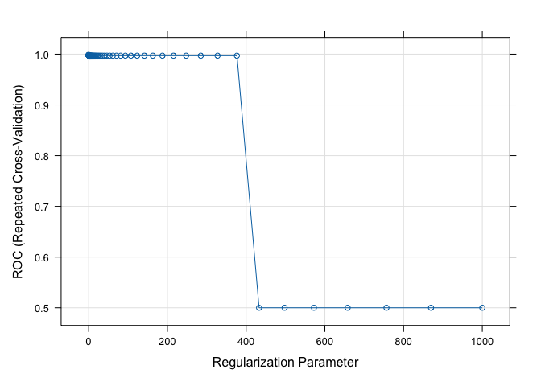

Regularization
================

Read in libraries

``` r
library(tidyverse)
```

    ## ── Attaching core tidyverse packages ──────────────────────── tidyverse 2.0.0 ──
    ## ✔ dplyr     1.1.4     ✔ readr     2.1.5
    ## ✔ forcats   1.0.0     ✔ stringr   1.5.1
    ## ✔ ggplot2   3.5.0     ✔ tibble    3.2.1
    ## ✔ lubridate 1.9.3     ✔ tidyr     1.3.1
    ## ✔ purrr     1.0.2     
    ## ── Conflicts ────────────────────────────────────────── tidyverse_conflicts() ──
    ## ✖ dplyr::filter() masks stats::filter()
    ## ✖ dplyr::lag()    masks stats::lag()
    ## ℹ Use the conflicted package (<http://conflicted.r-lib.org/>) to force all conflicts to become errors

``` r
library(caret)
```

    ## Loading required package: lattice
    ## 
    ## Attaching package: 'caret'
    ## 
    ## The following object is masked from 'package:purrr':
    ## 
    ##     lift

``` r
library(pROC)
```

    ## Type 'citation("pROC")' for a citation.
    ## 
    ## Attaching package: 'pROC'
    ## 
    ## The following objects are masked from 'package:stats':
    ## 
    ##     cov, smooth, var

Build custom AUC function to extract AUC from the caret model object

``` r
eval_mod <- function(model, data) {
  pred <- predict(model, data)
  cm <- caret::confusionMatrix(pred, data$classes, positive="malignant")
  auc <- roc(data$classes,
             predict(model, data, type = "prob")[, "malignant"]) %>% auc()
  result <- c(cm$overall["Accuracy"],cm$byClass['Sensitivity'], cm$byClass['Specificity'], cm$byClass['F1'],AUC=auc)
  return(result)
}
```

Read in clean data from EDA lab

``` r
bc_data <- readRDS("../EDA/bc_clean.RDS")
bc_data$classes <- as.factor(bc_data$classes)
```

``` r
set.seed(2024)
index <- caret::createDataPartition(bc_data$classes, p = 0.7, list = FALSE)

train_data <- bc_data[index, ]
test_data  <- bc_data[-index, ]
```

``` r
set.seed(859)
cctrl <- trainControl(method = "repeatedcv", 
                      number = 5, 
                      repeats = 3,  
                      savePredictions = TRUE,
                      summaryFunction = twoClassSummary,
                      classProbs = TRUE)

lambda <- 10^seq(-3, 3, length = 100)
alpha <- seq(0, 0.5, length = 6)
```

``` r
set.seed(859)
caret_full <- train(classes ~., 
                    data = train_data, 
                    method = "glm",
                    family="binomial",
                    preProcess = c("center", "scale"),
                    trControl = cctrl)
```

    ## Warning in train.default(x, y, weights = w, ...): The metric "Accuracy" was not
    ## in the result set. ROC will be used instead.

    ## Warning: glm.fit: fitted probabilities numerically 0 or 1 occurred

    ## Warning: glm.fit: fitted probabilities numerically 0 or 1 occurred

    ## Warning: glm.fit: fitted probabilities numerically 0 or 1 occurred

``` r
full <- eval_mod(caret_full, test_data)
```

    ## Setting levels: control = benign, case = malignant

    ## Setting direction: controls < cases

``` r
full
```

    ##    Accuracy Sensitivity Specificity          F1         AUC 
    ##   0.9521277   0.9130435   0.9747899   0.9333333   0.9915966

``` r
caret_full$finalModel 
```

    ## 
    ## Call:  NULL
    ## 
    ## Coefficients:
    ##                 (Intercept)              clump_thickness  
    ##                     -0.9526                       2.9789  
    ##     uniformity_of_cell_size     uniformity_of_cell_shape  
    ##                      1.5999                      -0.6836  
    ##           marginal_adhesion  single_epithelial_cell_size  
    ##                      0.8248                      -0.4071  
    ##                 bare_nuclei              bland_chromatin  
    ##                      3.2602                       1.1976  
    ##             normal_nucleoli                      mitosis  
    ##                      1.2130                       1.3229  
    ## 
    ## Degrees of Freedom: 440 Total (i.e. Null);  431 Residual
    ## Null Deviance:       578.8 
    ## Residual Deviance: 36.7  AIC: 56.7

``` r
caret_ridge <- train(classes ~., 
               data = train_data, 
               method = "glmnet",
               family="binomial",
               preProcess = c("center", "scale"),
               trControl = cctrl,
               tuneGrid = expand.grid(alpha = 0, lambda = lambda)
)

caret_ridge$bestTune 
```

    ##    alpha     lambda
    ## 27     0 0.03764936

``` r
plot(caret_ridge)
```

<!-- -->

``` r
names(caret_ridge)
```

    ##  [1] "method"       "modelInfo"    "modelType"    "results"      "pred"        
    ##  [6] "bestTune"     "call"         "dots"         "metric"       "control"     
    ## [11] "finalModel"   "preProcess"   "trainingData" "ptype"        "resample"    
    ## [16] "resampledCM"  "perfNames"    "maximize"     "yLimits"      "times"       
    ## [21] "levels"       "terms"        "coefnames"    "xlevels"

``` r
plot(caret_ridge$results$lambda,caret_ridge$results$Sens)
```

<!-- -->

``` r
caret_ridge$results$lambda[max(caret_ridge$results$Sens)]
```

    ## [1] 0.001

``` r
ridge <- eval_mod(caret_ridge, test_data)
```

    ## Setting levels: control = benign, case = malignant

    ## Setting direction: controls < cases

``` r
ridge
```

    ##    Accuracy Sensitivity Specificity          F1         AUC 
    ##   0.9521277   0.9275362   0.9663866   0.9343066   0.9933017

``` r
set.seed(859)
caret_lasso <- train(classes ~., 
                     data = train_data, 
                     method = "glmnet",
                     family="binomial",
                     preProcess = c("center", "scale"),
                     trControl = cctrl,
                     tuneGrid = expand.grid(alpha = 1, lambda = lambda)
)
```

    ## Warning in train.default(x, y, weights = w, ...): The metric "Accuracy" was not
    ## in the result set. ROC will be used instead.

``` r
lasso <- eval_mod(caret_lasso, test_data)
```

    ## Setting levels: control = benign, case = malignant

    ## Setting direction: controls < cases

``` r
lasso
```

    ##    Accuracy Sensitivity Specificity          F1         AUC 
    ##   0.9414894   0.8840580   0.9747899   0.9172932   0.9920838

``` r
set.seed(859)
caret_enet <- train(classes ~., 
                     data = train_data, 
                     method = "glmnet",
                     family="binomial",
                    preProcess = c("center", "scale"),
                    trControl = cctrl,
                     tuneGrid = expand.grid(alpha = alpha, lambda = lambda)
)
```

    ## Warning in train.default(x, y, weights = w, ...): The metric "Accuracy" was not
    ## in the result set. ROC will be used instead.

``` r
enet <- eval_mod(caret_enet, test_data)
```

    ## Setting levels: control = benign, case = malignant

    ## Setting direction: controls < cases

``` r
enet
```

    ##    Accuracy Sensitivity Specificity          F1         AUC 
    ##   0.9521277   0.9130435   0.9747899   0.9333333   0.9933017

``` r
caret_enet$bestTune
```

    ##     alpha      lambda
    ## 210   0.2 0.003511192

``` r
rbind(full,ridge, lasso, enet)
```

    ##        Accuracy Sensitivity Specificity        F1       AUC
    ## full  0.9521277   0.9130435   0.9747899 0.9333333 0.9915966
    ## ridge 0.9521277   0.9275362   0.9663866 0.9343066 0.9933017
    ## lasso 0.9414894   0.8840580   0.9747899 0.9172932 0.9920838
    ## enet  0.9521277   0.9130435   0.9747899 0.9333333 0.9933017

Model coefficients

``` r
coefs <- cbind(coef(caret_full$finalModel) %>% as.matrix(),
                coef(caret_ridge$finalModel, caret_ridge$bestTune$lambda),
                coef(caret_lasso$finalModel, caret_lasso$bestTune$lambda),
                coef(caret_enet$finalModel, caret_enet$bestTune$lambda))
colnames(coefs) <- c("full","ridge","lasso","enet")
coefs
```

    ## 10 x 4 sparse Matrix of class "dgCMatrix"
    ##                                   full      ridge       lasso        enet
    ## (Intercept)                 -0.9525882 -0.7858855 -0.81549591 -0.88807819
    ## clump_thickness              2.9788894  0.7014450  0.73775388  1.55097539
    ## uniformity_of_cell_size      1.5998903  0.5011281  0.66106159  0.68518759
    ## uniformity_of_cell_shape    -0.6835724  0.5158652  0.36794323  0.49879945
    ## marginal_adhesion            0.8247992  0.3830842  0.06512438  0.55445438
    ## single_epithelial_cell_size -0.4071046  0.3005620  .           0.05323548
    ## bare_nuclei                  3.2602201  0.8372585  1.19377777  1.79323165
    ## bland_chromatin              1.1975577  0.4910684  0.28722624  0.81994448
    ## normal_nucleoli              1.2129940  0.4489793  0.38534353  0.74774947
    ## mitosis                      1.3229289  0.2422233  .           0.57342150
