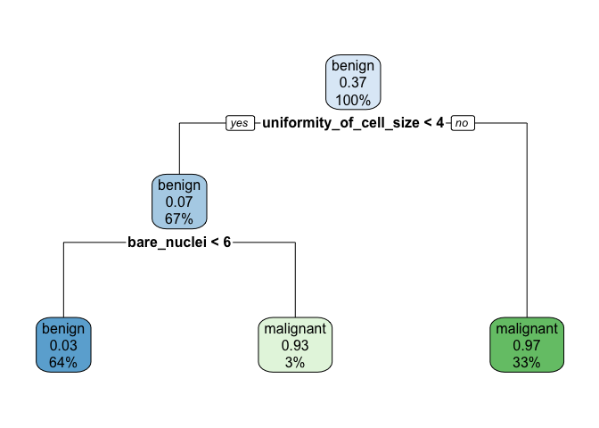
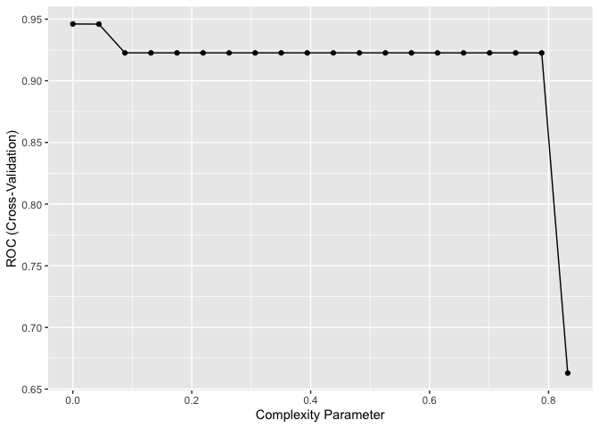
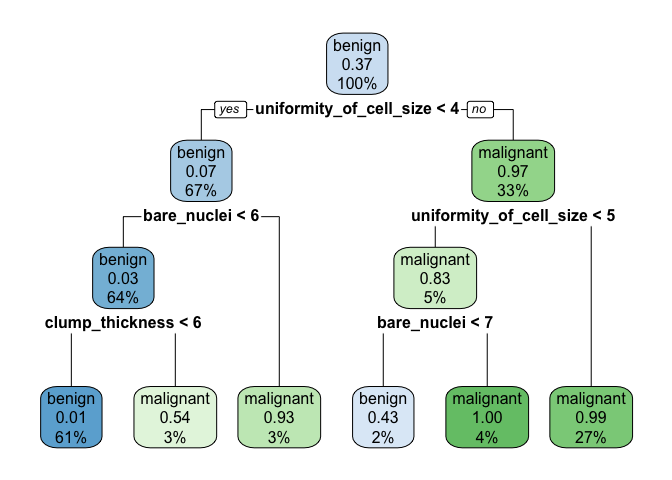

Trees and forests
================

# import libraries

``` r
library(tidyverse)
```

    ## ── Attaching core tidyverse packages ──────────────────────── tidyverse 2.0.0 ──
    ## ✔ dplyr     1.1.4     ✔ readr     2.1.5
    ## ✔ forcats   1.0.0     ✔ stringr   1.5.1
    ## ✔ ggplot2   3.5.0     ✔ tibble    3.2.1
    ## ✔ lubridate 1.9.3     ✔ tidyr     1.3.1
    ## ✔ purrr     1.0.2     
    ## ── Conflicts ────────────────────────────────────────── tidyverse_conflicts() ──
    ## ✖ dplyr::filter() masks stats::filter()
    ## ✖ dplyr::lag()    masks stats::lag()
    ## ℹ Use the conflicted package (<http://conflicted.r-lib.org/>) to force all conflicts to become errors

``` r
library(caret)
```

    ## Loading required package: lattice
    ## 
    ## Attaching package: 'caret'
    ## 
    ## The following object is masked from 'package:purrr':
    ## 
    ##     lift

``` r
library(pROC)
```

    ## Type 'citation("pROC")' for a citation.
    ## 
    ## Attaching package: 'pROC'
    ## 
    ## The following objects are masked from 'package:stats':
    ## 
    ##     cov, smooth, var

Build custom AUC function to extract AUC from the caret model object

``` r
eval_mod <- function(model, data) {
  pred <- predict(model, data)
  cm <- caret::confusionMatrix(pred, data$classes, positive="malignant")
  auc <- roc(data$classes,
             predict(model, data, type = "prob")[, "malignant"]) %>% auc()
  result <- c(cm$overall["Accuracy"],cm$byClass['Sensitivity'], cm$byClass['Specificity'], cm$byClass['F1'],AUC=auc)
  return(result)
}
```

# Read clean data

``` r
bc_data <- readRDS("../EDA/bc_clean.RDS")
bc_data$classes <- as.factor(bc_data$classes)
```

``` r
set.seed(2024)
index <- caret::createDataPartition(bc_data$classes, p = 0.7, list = FALSE)

train_data <- bc_data[index, ]
test_data  <- bc_data[-index, ]
```

``` r
train_data$classes %>% table(.)
```

    ## .
    ##    benign malignant 
    ##       280       161

``` r
set.seed(2024)
library(rpart)
tree_mod <- rpart(
  formula = classes ~. ,
  data    = train_data,
  method  = "class"
)
tree_mod
```

    ## n= 441 
    ## 
    ## node), split, n, loss, yval, (yprob)
    ##       * denotes terminal node
    ## 
    ## 1) root 441 161 benign (0.63492063 0.36507937)  
    ##   2) uniformity_of_cell_size< 3.5 297  22 benign (0.92592593 0.07407407)  
    ##     4) bare_nuclei< 5.5 283   9 benign (0.96819788 0.03180212) *
    ##     5) bare_nuclei>=5.5 14   1 malignant (0.07142857 0.92857143) *
    ##   3) uniformity_of_cell_size>=3.5 144   5 malignant (0.03472222 0.96527778) *

``` r
library(rpart.plot)
rpart.plot(tree_mod)
```

<!-- -->

# Pruning

We prune the tree using the cost complexity criterion. Can a less deep
tree give comparable results. If so, go with the shallower tree to
reduce the likelihood of overfitting. We used the a parameter called
complexity parameter (CP)

``` r
printcp(tree_mod)
```

    ## 
    ## Classification tree:
    ## rpart(formula = classes ~ ., data = train_data, method = "class")
    ## 
    ## Variables actually used in tree construction:
    ## [1] bare_nuclei             uniformity_of_cell_size
    ## 
    ## Root node error: 161/441 = 0.36508
    ## 
    ## n= 441 
    ## 
    ##         CP nsplit rel error  xerror     xstd
    ## 1 0.832298      0  1.000000 1.00000 0.062798
    ## 2 0.074534      1  0.167702 0.16770 0.031271
    ## 3 0.010000      2  0.093168 0.12422 0.027140

It computes the cross validation error for each value of cp CP=0.01
gives the lowest error

``` r
opt <- which.min(tree_mod$cptable[,"xerror"])
```

get its value

``` r
cp <- tree_mod$cptable[opt, "CP"]
cp
```

    ## [1] 0.01

We can prune the tree based on this CP

``` r
pruned_model <- prune(tree_mod,cp)
#plot tree
rpart.plot(pruned_model)
```

<!-- --> \#Note that
rpart will use a default CP value of 0.01 if you don’t specify one in
prune.

``` r
pred <- predict(object = tree_mod,   # model object 
                newdata = test_data,
                type="class")  # test dataset
pruned_tree_metrics <- caret::confusionMatrix(pred,test_data$classes, positive = "malignant")
pruned_tree_metrics
```

    ## Confusion Matrix and Statistics
    ## 
    ##            Reference
    ## Prediction  benign malignant
    ##   benign       114         6
    ##   malignant      5        63
    ##                                           
    ##                Accuracy : 0.9415          
    ##                  95% CI : (0.8977, 0.9704)
    ##     No Information Rate : 0.633           
    ##     P-Value [Acc > NIR] : <2e-16          
    ##                                           
    ##                   Kappa : 0.8737          
    ##                                           
    ##  Mcnemar's Test P-Value : 1               
    ##                                           
    ##             Sensitivity : 0.9130          
    ##             Specificity : 0.9580          
    ##          Pos Pred Value : 0.9265          
    ##          Neg Pred Value : 0.9500          
    ##              Prevalence : 0.3670          
    ##          Detection Rate : 0.3351          
    ##    Detection Prevalence : 0.3617          
    ##       Balanced Accuracy : 0.9355          
    ##                                           
    ##        'Positive' Class : malignant       
    ## 

``` r
set.seed(2024)
caret_tree <- train(
  classes ~ .,
  data = train_data,
  method = "rpart",
  metric ="ROC",
  trControl = trainControl(method = "cv", number = 5,
                           classProbs = T, summaryFunction = twoClassSummary),
  tuneLength = 20
)
ggplot(caret_tree)
```

<!-- -->

``` r
caret_tree$bestTune
```

    ##   cp
    ## 1  0

``` r
rpart.plot(caret_tree$finalModel)
```

<!-- -->

``` r
tree <- eval_mod(caret_tree,test_data)
```

    ## Setting levels: control = benign, case = malignant

    ## Setting direction: controls < cases

``` r
tree
```

    ##    Accuracy Sensitivity Specificity          F1         AUC 
    ##   0.9042553   0.8840580   0.9159664   0.8714286   0.9437949

``` r
tree_bag1 <- ipred::bagging(
formula = classes ~ .,
data = train_data,
nbagg = 500,  
coob = TRUE
)
tree_bag1
```

    ## 
    ## Bagging classification trees with 500 bootstrap replications 
    ## 
    ## Call: bagging.data.frame(formula = classes ~ ., data = train_data, 
    ##     nbagg = 500, coob = TRUE)
    ## 
    ## Out-of-bag estimate of misclassification error:  0.0249

``` r
set.seed(2024)
caret_bag <- train(
  classes ~ .,
  data = train_data,
  method = "treebag",
  trControl = trainControl(method = "cv", number = 5,
                           classProbs = T, summaryFunction = twoClassSummary),
  metric ="ROC",
  nbagg = 20,  
  control = rpart.control(minsplit = 2, cp = 0)
)
caret_bag
```

    ## Bagged CART 
    ## 
    ## 441 samples
    ##   9 predictor
    ##   2 classes: 'benign', 'malignant' 
    ## 
    ## No pre-processing
    ## Resampling: Cross-Validated (5 fold) 
    ## Summary of sample sizes: 353, 353, 353, 352, 353 
    ## Resampling results:
    ## 
    ##   ROC        Sens   Spec   
    ##   0.9890067  0.975  0.98125

``` r
bag <- eval_mod(caret_bag,test_data)
```

    ## Setting levels: control = benign, case = malignant

    ## Setting direction: controls < cases

``` r
rbind(tree, bag)
```

    ##       Accuracy Sensitivity Specificity        F1       AUC
    ## tree 0.9042553   0.8840580   0.9159664 0.8714286 0.9437949
    ## bag  0.9468085   0.9275362   0.9579832 0.9275362 0.9901352

# Random Forest

``` r
library(randomForest)
```

    ## randomForest 4.7-1.1

    ## Type rfNews() to see new features/changes/bug fixes.

    ## 
    ## Attaching package: 'randomForest'

    ## The following object is masked from 'package:dplyr':
    ## 
    ##     combine

    ## The following object is masked from 'package:ggplot2':
    ## 
    ##     margin

``` r
# Train a Random Forest
set.seed(2024)  # for reproducibility
rf_model <- randomForest(formula = classes ~ ., 
                         data = train_data)

# Print the model output                             
print(rf_model)
```

    ## 
    ## Call:
    ##  randomForest(formula = classes ~ ., data = train_data) 
    ##                Type of random forest: classification
    ##                      Number of trees: 500
    ## No. of variables tried at each split: 3
    ## 
    ##         OOB estimate of  error rate: 2.04%
    ## Confusion matrix:
    ##           benign malignant class.error
    ## benign       275         5  0.01785714
    ## malignant      4       157  0.02484472

``` r
caret_rf <- train(
  classes ~ .,
  data = train_data,                         
  method = "ranger",
  metric = "ROC",
  trControl = trainControl(method = "cv", number = 5, classProbs = TRUE, summaryFunction = twoClassSummary),
  importance="impurity"
)

forest <- eval_mod(caret_rf,test_data)
```

    ## Setting levels: control = benign, case = malignant

    ## Setting direction: controls < cases

``` r
roc_tree <- roc(test_data$classes,
             predict(pruned_model, test_data, type = "prob")[, "malignant"]) %>% auc()
```

    ## Setting levels: control = benign, case = malignant
    ## Setting direction: controls < cases

``` r
pruned_tree <- c(pruned_tree_metrics$overall['Accuracy'], pruned_tree_metrics$byClass['Sensitivity'],
                 pruned_tree_metrics$byClass['Specificity'], pruned_tree_metrics$byClass['F1'],  "AUC" = roc_tree)
rbind(pruned_tree, tree, bag, forest)
```

    ##              Accuracy Sensitivity Specificity        F1       AUC
    ## pruned_tree 0.9414894   0.9130435   0.9579832 0.9197080 0.9330776
    ## tree        0.9042553   0.8840580   0.9159664 0.8714286 0.9437949
    ## bag         0.9468085   0.9275362   0.9579832 0.9275362 0.9901352
    ## forest      0.9521277   0.9130435   0.9747899 0.9333333 0.9924492
